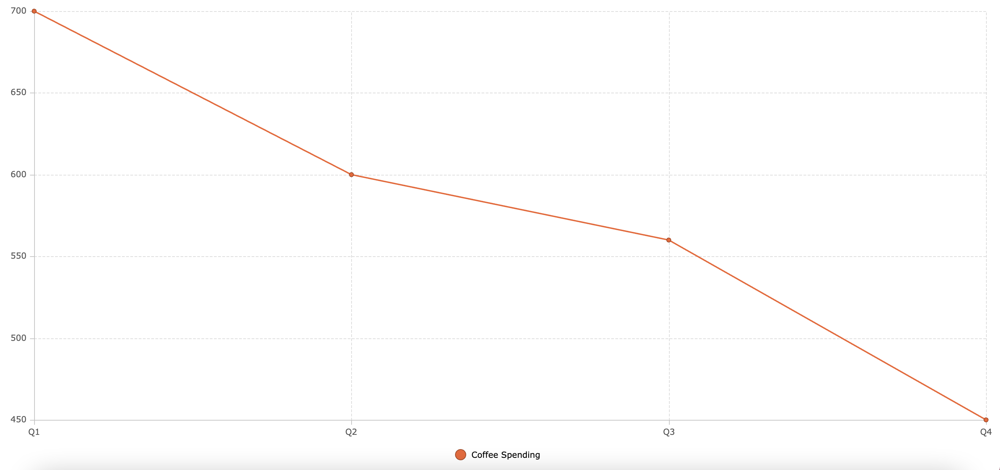
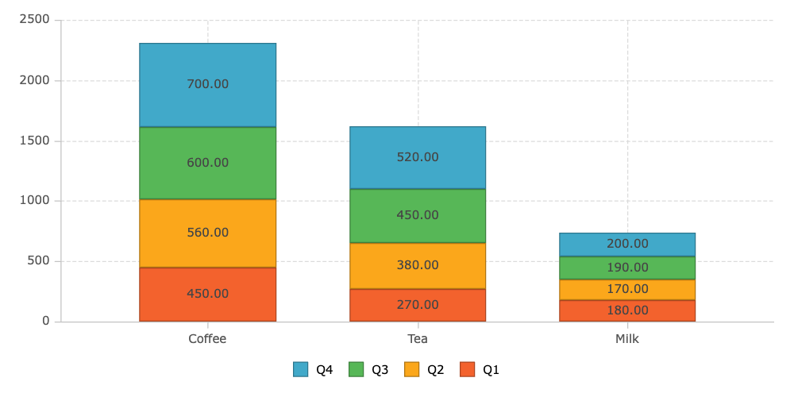
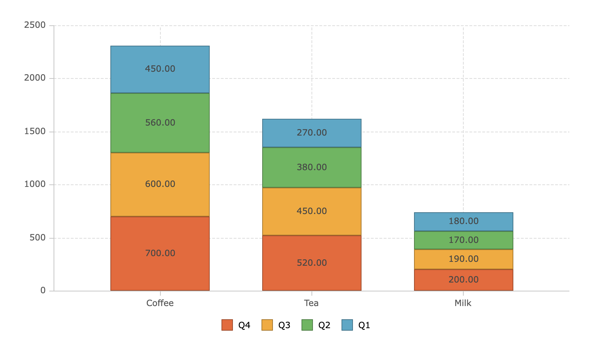
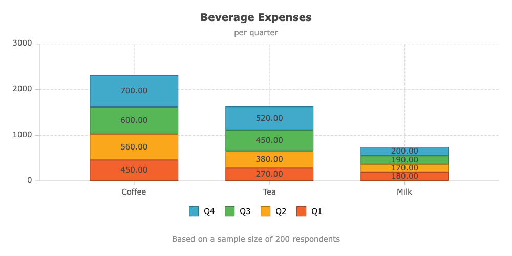

<style>
    .gatsby-resp-image-wrapper {
        margin-left: 0 !important;
        margin-right: 0 !important;
        margin-bottom: 1rem;
    }
    .gatsby-resp-image-image {
        box-shadow: none !important;
    }

    .code-tab pre {
        margin-top: 0;
    }

    .code-tab .nav-item {
        margin-bottom: 0 !important;
    }
</style>

AG Charts is a powerful standalone component with no dependencies. The charts factory API can be used to seamlessly create and update data visualizations independently of the grid.

<section class="code-tab mb-3">
<div class="card">
<div class="card-header">Quick Look Code Example</div>
<div class="card-body">
<ul class="nav nav-tabs">
<li class="nav-item">
<a  class="nav-link active" id="component-tab" data-toggle="tab" href="#component" role="tab" aria-controls="component" aria-selected="true">

[[only-javascript]]
| main.js

[[only-angular]]
| app.component.ts

[[only-react]]
| index.js

[[only-vue]]
| App.vue

</a>
</li>

[[only-angular]]
| <li class="nav-item">
| <a class="nav-link" id="module-tab" data-toggle="tab" href="#module" role="tab" aria-controls="module" aria-selected="false">
| <p>app.module.ts</p>
| </a>
| </li>

<li class="nav-item">
<a class="nav-link" id="template-tab" data-toggle="tab" href="#template" role="tab" aria-controls="template" aria-selected="false">

[[only-javascript]]
| index.html

[[only-angular]]
| app.component.html

[[only-react]]
| index.html

[[only-vue]]
| main.js

</a>
</li>
</ul>
<div class="tab-content">
<div class="tab-pane show active" id="component" role="tabpanel" aria-labelledby="component-tab">

[[only-javascript]]
| ```js
| var data = [
|     {
|         beverage: 'Coffee',
|         Q1: 450,
|         Q2: 560,
|         Q3: 600,
|         Q4: 700
|     },
|     {
|         beverage: 'Tea',
|         Q1: 270,
|         Q2: 380,
|         Q3: 450,
|         Q4: 520
|     },
|     {
|         beverage: 'Milk',
|         Q1: 180,
|         Q2: 170,
|         Q3: 190,
|         Q4: 200
|     },
| ];
|
| var options = {
|     container: document.querySelector('#myChart'),
|     data: data,
|     title: {
|         text: 'Beverage Expenses'
|     },
|     subtitle: {
|         text: 'per quarter'
|     },
|     padding: {
|         top: 40,
|         right: 40,
|         bottom: 40,
|         left: 40
|     },
|     series: [
|         { type: 'column', xKey: 'beverage', yKey: 'Q1', stacked: true },
|         { type: 'column', xKey: 'beverage', yKey: 'Q2', stacked: true },
|         { type: 'column', xKey: 'beverage', yKey: 'Q3', stacked: true },
|         { type: 'column', xKey: 'beverage', yKey: 'Q4', stacked: true },
|     ],
|     legend: {
|         spacing: 40
|     },
| };
|
| agCharts.AgChart.create(options);
| ```

[[only-angular]]
| ```jsx
| import { Component } from '@angular/core';
|
| @Component({
|     selector: 'my-app',
|     templateUrl: './app.component.html'
| })
| export class AppComponent {
|     private options: any;
|
|     beverageSpending = [
|         {
|             beverage: 'Coffee',
|             Q1: 450,
|             Q2: 560,
|             Q3: 600,
|             Q4: 700,
|         },
|         {
|             beverage: 'Tea',
|             Q1: 270,
|             Q2: 380,
|             Q3: 450,
|             Q4: 520,
|         },
|         {
|             beverage: 'Milk',
|             Q1: 180,
|             Q2: 170,
|             Q3: 190,
|             Q4: 200,
|         },
|     ];
|     constructor() {
|         this.options = {
|             data: this.beverageSpending,
|             title: {
|                 text: 'Beverage Expenses',
|             },
|             subtitle: {
|                 text: 'per quarter',
|             },
|             series: [
|                 { type: 'column', xKey: 'beverage', yKey: 'Q1', stacked: true },
|                 { type: 'column', xKey: 'beverage', yKey: 'Q2', stacked: true },
|                 { type: 'column', xKey: 'beverage', yKey: 'Q3', stacked: true },
|                 { type: 'column', xKey: 'beverage', yKey: 'Q4', stacked: true },
|             ],
|         };
|     }
| }
| ```

[[only-react]]
| ```jsx
| import React, { Component } from 'react';
| import { AgChartsReact } from 'ag-charts-react';
|
| export default class ChartExample extends Component {
|     data = [
|         {
|             beverage: 'Coffee',
|             Q1: 450,
|             Q2: 560,
|             Q3: 600,
|             Q4: 700,
|         },
|         {
|             beverage: 'Tea',
|             Q1: 270,
|             Q2: 380,
|             Q3: 450,
|             Q4: 520,
|         },
|         {
|             beverage: 'Milk',
|             Q1: 180,
|             Q2: 170,
|             Q3: 190,
|             Q4: 200,
|         },
|     ];
|
|     constructor(props) {
|         super(props);
|
|         this.state = {
|             options: {
|                 data: this.data,
|                 title: { text: 'Beverage Expenses' },
|                 subtitle: { text: 'per quarter' },
|                 padding: {
|                     top: 40,
|                     right: 40,
|                     bottom: 40,
|                     left: 40,
|                 },
|                 series: [
|                     { type: 'column', xKey: 'beverage', yKey: 'Q1', stacked: true },
|                     { type: 'column', xKey: 'beverage', yKey: 'Q2', stacked: true },
|                     { type: 'column', xKey: 'beverage', yKey: 'Q3', stacked: true },
|                     { type: 'column', xKey: 'beverage', yKey: 'Q4', stacked: true },
|                 ],
|                 legend: { spacing: 40 },
|             },
|         };
|     }
|
|     render() {
|         return <AgChartsReact options={this.state.options} />;
|     }
| }
| ```

[[only-vue]]
| ```html
| <template>
|     <div id="app">
|         <ag-charts-vue :options="options"></ag-charts-vue>
|     </div>
| </template>
|
| <script>
|     import {AgChartsVue} from 'ag-charts-vue';
|
|     export default {
|         name: 'App',
|         components: {
|             AgChartsVue,
|         },
|         data() {
|             return {
|                 options: null,
|                 data: [
|                     {
|                         beverage: 'Coffee',
|                         Q1: 450,
|                         Q2: 560,
|                         Q3: 600,
|                         Q4: 700,
|                     },
|                     {
|                         beverage: 'Tea',
|                         Q1: 270,
|                         Q2: 380,
|                         Q3: 450,
|                         Q4: 520,
|                     },
|                     {
|                         beverage: 'Milk',
|                         Q1: 180,
|                         Q2: 170,
|                         Q3: 190,
|                         Q4: 200,
|                     },
|                 ],
|             };
|         },
|         beforeMount() {
|             this.options = {
|                 data: this.data,
|                 title: {
|                     text: 'Beverage Expenses',
|                 },
|                 subtitle: {
|                     text: 'per quarter',
|                 },
|                 series: [
|                     { type: 'column', xKey: 'beverage', yKey: 'Q1', label: {}, stacked: true },
|                     { type: 'column', xKey: 'beverage', yKey: 'Q2', label: {}, stacked: true },
|                     { type: 'column', xKey: 'beverage', yKey: 'Q3', label: {}, stacked: true },
|                     { type: 'column', xKey: 'beverage', yKey: 'Q4', label: {}, stacked: true },
|                 ],
|             };
|         }
|     };
| </script>
|
| <style>
| </style>
| ```

</div>

[[only-angular]]
| <div class="tab-pane" id="module" role="tabpanel" aria-labelledby="module-tab">
|
| ```jsx
| import { BrowserModule } from '@angular/platform-browser';
| import { NgModule } from '@angular/core';
| import { AgChartsAngularModule } from 'ag-charts-angular';
| import { AppComponent } from './app.component';
|
| @NgModule({
|     imports: [
|         BrowserModule,
|         AgChartsAngularModule
|     ],
|     declarations: [AppComponent],
|     bootstrap: [AppComponent],
| })
| export class AppModule {
| }
| ```
| </div>

<div class="tab-pane" id="template" role="tabpanel" aria-labelledby="template-tab">

[[only-javascript]]
| ```html
| <!DOCTYPE html>
| <html lang="en">
|     <head>
|         <title>AG Charts Basic Example</title>
|         <script src="https://unpkg.com/ag-charts-community/dist/ag-charts-community.min.js">
|         </script>
|     </head>
|     <body>
|         <div id="myChart" style="position: absolute; top: 0; right: 0; bottom: 0; left: 0;"></div>
|         <script src="main.js"></script>
|     </body>
| </html>
| ```

[[only-angular]]
| ```html
| <ag-charts-angular
|     style="position: absolute; top: 0; right: 0; bottom: 0; left: 0;"
|     [options]="options">
| </ag-charts-angular>
| ```

[[only-react]]
| ```html
| <div id="root"></div>
| ```

[[only-vue]]
| ```jsx
| import Vue from 'vue'
| import App from './App.vue'
|
| Vue.config.productionTip = false
|
| new Vue({
|   render: h => h(App),
| }).$mount('#app')
| ```

</div>
</div>
</div>
<div class="text-right" style="margin-top: -1.5rem;">

[[only-javascript]]
| <a class="btn btn-dark mb-2 mr-3" href="https://plnkr.co/edit/4RA1NMI4unVHfRaV?preview" target="_blank">
|     Open in  Plunker
| </a>

[[only-angular]]
| <a class="btn btn-dark mb-2 mr-3" href="https://stackblitz.com/edit/ag-charts-angular-hello-world-cxth9c" target="_blank">
|     Open in  StackBlitz
| </a>

[[only-react]]
| <a class="btn btn-dark mb-2 mr-3" href="https://stackblitz.com/edit/ag-charts-react-hello-world-daq5bw" target="_blank">
|     Open in  StackBlitz
| </a>


[[only-vue]]
| <a class="btn btn-dark mb-2 mr-3" href="https://stackblitz.com/edit/ag-charts-vue-hello-world-uqr6hk" target="_blank">
|     Open in  StackBlitz
| </a>

</div>
</div>
</section>

[[only-vue]]
| [[note]]
| | The "Quick Look Code" above is different to the code that runs in Stackblitz - this is because Stackblitz doesn't support .vue files at this time.

## Getting Started

[[only-javascript]]
| In this article we will walk through the necessary steps to add AG Charts to an existing JavaScript project and produce your first chart.
|
| ## Your First Chart
|
| Let's say you want to visualise how much you spend on coffee each quarter and that you have the following data:
|
| ```js
| var data = [
|     {
|         quarter: 'Q1',
|         spending: 450,
|     },
|     {
|         quarter: 'Q2',
|         spending: 560,
|     },
|     {
|         quarter: 'Q3',
|         spending: 600,
|     },
|     {
|         quarter: 'Q4',
|         spending: 700,
|     },
| ];
| ```
|
| To render it we can use this simple chart factory configuration:
|
| ```js
| agCharts.AgChart.create({
|     data: data,
|     container: document.querySelector('#myChart'),
|     series: [{
|         xKey: 'quarter',
|         yKey: 'spending',
|     }],
| });
| ```
|
| Here we pass in the `data` we want to render, the `container` element for the chart (our chart won't be attached to the DOM without it) and the `series` to use to plot the data.
|
| The series `type` defaults to `'line'` so the only series configuration we need to specify is which keys to use to fetch the data to be plotted along the horizontal (x) and vertical (y) axes.

[[only-angular]]
| In this article we will walk through the necessary steps to add AG Charts to an existing Angular project and produce your first charts.
|
| ## Add AG Charts to Your Project
|
| For the purposes of this tutorial, we are going to scaffold an Angular app with the [Angular CLI](https://cli.angular.io/).
|
| Don't worry if your project has a different configuration - AG Charts and its Angular wrapper are distributed as NPM packages and work with all common Angular project setups.
|
| Let's follow the [Angular CLI instructions](https://github.com/angular/angular-cli#installation) and run the following in your terminal:
|
| ```bash
| npm install -g @angular/cli
| ng new my-app --routing false
| cd my-app
| ng serve
| ```
|
| If everything goes well, `ng serve` has started the web server. You can open your app at <a href="http://localhost:4200" target="_blank">localhost:4200</a>.
|
|
| As a next step, let's add the AG Charts NPM packages. If you are not using the latest version of Angular check the [compatibility table](#compatible-versions) below. Run the following command in `my-app` (you may need a new instance of the terminal):
|
| ```bash
| npm install --save ag-charts-community ag-charts-angular
| npm install # in certain circumstances npm will perform an "auto prune". This step ensures all expected dependencies are present
| ```
|
| After a few seconds of waiting, you should be good to go. Let's get to the actual coding! As a first step, let's add the AG Charts Angular module to our app module (`src/app/app.module.ts`):
|
| ```ts
| import { BrowserModule } from '@angular/platform-browser';
| import { NgModule } from '@angular/core';
| import { AgChartsAngularModule } from 'ag-charts-angular';
| import { AppComponent } from './app.component';
|
| @NgModule({
|     imports: [
|         BrowserModule,
|         AgChartsAngularModule
|     ],
|     declarations: [AppComponent],
|     bootstrap: [AppComponent],
| })
| export class AppModule {
| }
| ```
|
| Next, let's declare the basic chart configuration. Edit `src/app.component.ts`:
|
| ```ts
| import { Component } from '@angular/core';
|
| @Component({
|     selector: 'app-root',
|     templateUrl: './app.component.html'
| })
| export class AppComponent {
|     public options: any;
|
|     data = [
|         {
|             quarter: 'Q1',
|             spending: 450,
|         },
|         {
|             quarter: 'Q2',
|             spending: 560,
|         },
|         {
|             quarter: 'Q3',
|             spending: 600,
|         },
|         {
|             quarter: 'Q4',
|             spending: 700,
|         },
|     ];
|
|     constructor() {
|         this.options = {
|             data: this.data,
|             series: [{
|                 xKey: 'quarter',
|                 yKey: 'spending',
|             }],
|         };
|     }
| }
| ```
|
| Here we'll provide the `options` we want to use for our chart, including the `series` to use to plot the data.
|
| The series `type` defaults to `'line'`, so the only series configuration we need to specify is to tell the series which keys to use to fetch the data to be plotted along the horizontal (x) and vertical (y) axes.
|
| Finally, let's add the component definition to our template. Edit `app/app.component.html` and remove the scaffold code:
|
| ```html
| <ag-charts-angular
|     style="position: absolute; top: 0; right: 0; bottom: 0; left: 0;"
|     [options]="options">
| </ag-charts-angular>
| ```

[[only-react]]
| In this article we will walk through the necessary steps to add AG Charts to an existing React project and produce your first charts.
|
| ## Add AG Charts to Your Project
|
| For the purposes of this tutorial, we are going to scaffold a React app with [create-react-app](https://github.com/facebook/create-react-app).
|
| Don't worry if your project has a different configuration - AG Charts and the React wrapper are distributed as NPM packages, which should work with any common React project module bundler setup.
|
| Let's follow the [create-react-app instructions](https://github.com/facebook/create-react-app#quick-overview) and run the following commands in your terminal:
|
| ```bash
| npx create-react-app my-app
| cd my-app
| npm start
| ```
|
| If everything goes well, `npm start` has started the web server and conveniently opened a browser pointing to <a href="http://localhost:3000" target="_blank">localhost:3000</a>.
|
| As a next step, let's add the AG Charts NPM packages. Run the following command in `my-app` (you may need a new instance of the terminal):
|
| ```bash
| npm install --save ag-charts-community ag-charts-react
| ```
|
| After a few seconds of waiting, you should be good to go. Let's get to the actual coding! Open `src/App.js` in your favourite text editor and change its contents to the following:
|
| ```jsx
| import React, { Component } from 'react';
| import { AgChartsReact } from 'ag-charts-react';
|
| export default class ChartExample extends Component {
|     data = [
|         {
|             quarter: 'Q1',
|             spending: 450,
|         },
|         {
|             quarter: 'Q2',
|             spending: 560,
|         },
|         {
|             quarter: 'Q3',
|             spending: 600,
|         },
|         {
|             quarter: 'Q4',
|             spending: 700,
|         },
|     ];
|
|     constructor(props) {
|         super(props);
|
|         this.state = {
|             options: {
|                 data: this.data,
|                 series: [{
|                     xKey: 'quarter',
|                     yKey: 'spending',
|                 }],
|             },
|         };
|     }
|
|     render() {
|         return <AgChartsReact options={this.state.options} />;
|     }
| }
| ```
|
| Here we'll provide the `options` we want to use for our chart, including the `series` to use to plot the data.
|
| The series `type` defaults to `'line'` so the only series configuration we need to specify is to tell the series which keys to use to fetch the data to be plotted along the horizontal (x) and vertical (y) axes.

[[only-vue]]
| In this article we will walk through the necessary steps to add AG Charts to an existing Vue project and produce your first charts.
|
| ## Add AG Charts to Your Project
|
| For the purposes of this tutorial, we are going to scaffold an Vue app with the [Vue CLI](https://cli.vuejs.org/).
|
| Don't worry if your project has a different configuration. AG Charts and its Vue wrapper are distributed as NPM packages and work with any common Vue project setup.
|
| Let's follow the [Vue CLI instructions](https://cli.vuejs.org/) and run the following in your terminal:
|
| ```bash
| npm install -g @vue/cli
| vue create my-project
| ```
|
| When prompted choose `default (babel, eslint)`:
|
| 
|
| We're now ready to start our application:
|
| ```bash
| cd my-project
| npm run serve
| ```
|
| If everything goes well, `npm run serve` has started the web server. You can open the default app at <a href="http://localhost:8080" target="_blank">localhost:8080</a>.
|
| Let's add the AG Charts NPM packages. Run the following command in `my-project` (you may need a new instance of the terminal):
|
| ```bash
| npm install --save ag-charts-community ag-charts-vue vue-property-decorator
| ```
|
| After a few seconds of waiting, you should be good to go. Let's get to the actual coding! As a first step, let's add the AG Charts module. As this will be a simple example we can delete the `src/components` directory. Our example application will live in `src/App.vue`.
|
| Let's add the component definition to our template. Edit `src/App.vue` and replace the scaffold code:
|
| ```html
| <template>
|   <div id="app">
|       <ag-charts-vue :options="options"></ag-charts-vue>
|   </div>
| </template>
| ```
|
| Next, let's declare the basic charts configuration. Edit `src/App.vue`:
|
| ```html
| <script>
|   import { AgChartsVue } from 'ag-charts-vue';
|
|   export default {
|     name: 'App',
|     components: {
|       AgChartsVue,
|     },
|     data() {
|       return {
|         options: null,
|         data: [
|           {
|             quarter: 'Q1',
|             spending: 450,
|           },
|           {
|             quarter: 'Q2',
|             spending: 560,
|           },
|           {
|             quarter: 'Q3',
|             spending: 600,
|           },
|           {
|             quarter: 'Q4',
|             spending: 700,
|           },
|         ]
|       };
|     },
|     beforeMount() {
|       this.options = {
|         data: this.data,
|         series: [{
|           xKey: 'quarter',
|           yKey: 'spending',
|         }]
|       };
|     }
|   };
| </script>
| ```
|
| Here we'll provide the `options` we want to use for our chart, including the `series` to use to plot the data.
|
| The series `type` defaults to `'line'` so the only series configuration we need to specify is to tell the series which keys to use to fetch the data to be plotted along the horizontal (x) and vertical (y) axes.</p>
|

The `series` property is an array because it is possible to supply multiple series (including mixed kinds!) into a single chart.

The default `axes` configuration is a `category` axis on the bottom and `number` axis on the left of a chart, both of which are exactly what we need in this case, so we don't need to supply these here.

The chart also features a legend by default which uses the `yKey` for the series, which in this case is `'spending'`.


## Customising the Legend

If we don't want the legend to show the `yKey` itself we can give it a name, for example `'Coffee Spending'`.

This name is more descriptive but also longer, so let's position the legend on the bottom of the chart to make more space for the series:

[[only-javascript]]
| ```diff
| agCharts.AgChart.create({
|     data: data,
|     container: document.querySelector('#myChart'),
|     series: [{
|         xKey: 'quarter',
|         yKey: 'spending',
| +       yName: 'Coffee Spending',
|     }],
| +   legend: {
| +       position: 'bottom',
| +   },
| });
| ```

[[only-angular]]
| ```diff
| constructor() {
|     this.options = {
|         data: this.data,
|         series: [{
|             xKey: 'quarter',
|             yKey: 'spending',
| +           yName: 'Coffee Spending',
|         }],
| +       legend: {
| +           position: 'bottom',
| +       },
|     };
| }
| ```

[[only-react]]
| ```diff
| constructor(props) {
|     super(props);
|
|     this.state = {
|         options: {
|             data: this.data,
|             series: [{
|                 xKey: 'quarter',
|                 yKey: 'spending',
| +               yName: 'Coffee Spending',
|             }],
| +           legend: {
| +               position: 'bottom',
| +           },
|         }
|     }
| }
| ```

[[only-vue]]
| ```diff
| beforeMount() {
|     this.options = {
|         data: this.data,
|         series: [{
|             xKey: 'quarter',
|             yKey: 'spending',
| +           yName: 'Coffee Spending',
|         }],
| +       legend: {
| +           position: 'bottom',
| +       },
|     };
| }
| ```



## Basic Column Chart

Now let's try something more interesting. Let's say you want to visualise how much is spent on coffee, milk and tea in your company each quarter and in total. Your data might look something like this:

[[only-javascript]]
| ```js
| var data = [
|     {
|         beverage: 'Coffee',
|         Q1: 450,
|         Q2: 560,
|         Q3: 600,
|         Q4: 700,
|     },
|     {
|         beverage: 'Tea',
|         Q1: 270,
|         Q2: 380,
|         Q3: 450,
|         Q4: 520,
|     },
|     {
|         beverage: 'Milk',
|         Q1: 180,
|         Q2: 170,
|         Q3: 190,
|         Q4: 200,
|     },
| ];
| ```

[[only-frameworks]]
| ```js
| data = [
|     {
|         beverage: 'Coffee',
|         Q1: 450,
|         Q2: 560,
|         Q3: 600,
|         Q4: 700,
|     },
|     {
|         beverage: 'Tea',
|         Q1: 270,
|         Q2: 380,
|         Q3: 450,
|         Q4: 520,
|     },
|     {
|         beverage: 'Milk',
|         Q1: 180,
|         Q2: 170,
|         Q3: 190,
|         Q4: 200,
|     },
| ];
| ```

[[only-javascript]]
| This time, let's choose another series type to plot the data: stacked columns. Here's the chart factory configuration we can use to do that:
|
| ```js
| agCharts.AgChart.create({
|     data: data,
|     container: document.querySelector('#myChart'),
|     series: [
|         { type: 'column', xKey: 'beverage', yKey: 'Q1', stacked: true },
|         { type: 'column', xKey: 'beverage', yKey: 'Q2', stacked: true },
|         { type: 'column', xKey: 'beverage', yKey: 'Q3', stacked: true },
|         { type: 'column', xKey: 'beverage', yKey: 'Q4', stacked: true },
|     ],
| });
| ```

[[only-frameworks]]
| This time, let's choose another series type to plot the data: stacked columns. Here's the chart configuration we can use to do that:

[[only-angular]]
| ```ts
| constructor() {
|     this.options = {
|         data: this.data,
|         series: [
|             { type: 'column', xKey: 'beverage', yKey: 'Q1', stacked: true },
|             { type: 'column', xKey: 'beverage', yKey: 'Q2', stacked: true },
|             { type: 'column', xKey: 'beverage', yKey: 'Q3', stacked: true },
|             { type: 'column', xKey: 'beverage', yKey: 'Q4', stacked: true },
|         ],
|     };
| }
| ```

[[only-react]]
| ```js
| constructor(props) {
|     super(props);
|
|     this.state = {
|         options: {
|             data: this.data,
|             series: [
|                 { type: 'column', xKey: 'beverage', yKey: 'Q1', stacked: true },
|                 { type: 'column', xKey: 'beverage', yKey: 'Q2', stacked: true },
|                 { type: 'column', xKey: 'beverage', yKey: 'Q3', stacked: true },
|                 { type: 'column', xKey: 'beverage', yKey: 'Q4', stacked: true },
|             ],
|         }
|     }
| }
| ```

[[only-vue]]
| ```js
| beforeMount() {
|     this.options = {
|         data: this.data,
|         series: [
|             { type: 'column', xKey: 'beverage', yKey: 'Q1', stacked: true },
|             { type: 'column', xKey: 'beverage', yKey: 'Q2', stacked: true },
|             { type: 'column', xKey: 'beverage', yKey: 'Q3', stacked: true },
|             { type: 'column', xKey: 'beverage', yKey: 'Q4', stacked: true },
|         ],
|     };
| }
| ```

Chart tooltips are enabled by default so you can hover over a block to see its value.



## Labels and Titles

We can enhance our chart by providing a label for each block segment. We can set a label's `fontSize`, `fontFamily` and other properties, but for now we'll just accept the default values:

[[only-javascript]]
| ```diff
| agCharts.AgChart.create({
|     data: data,
|     container: document.querySelector('#myChart'),
|     series: [
|         {
|             type: 'column',
|             xKey: 'beverage',
|             yKey: 'Q1',
|             stacked: true,
| +           label: {},
|         },
|         {
|             type: 'column',
|             xKey: 'beverage',
|             yKey: 'Q2',
|             stacked: true,
| +           label: {},
|         },
|         {
|             type: 'column',
|             xKey: 'beverage',
|             yKey: 'Q3',
|             stacked: true,
| +           label: {},
|         },
|         {
|             type: 'column',
|             xKey: 'beverage',
|             yKey: 'Q4',
|             stacked: true,
| +           label: {},
|         },
|     ],
| });
| ```

[[only-angular]]
| ```diff
| constructor() {
|     this.options = {
|         data: this.data,
|         series: [
|             {
|                 type: 'column',
|                 xKey: 'beverage',
|                 yKey: 'Q1',
|                 stacked: true,
| +               label: {},
|             },
|             {
|                 type: 'column',
|                 xKey: 'beverage',
|                 yKey: 'Q2',
|                 stacked: true,
| +               label: {},
|             },
|             {
|                 type: 'column',
|                 xKey: 'beverage',
|                 yKey: 'Q3',
|                 stacked: true,
| +               label: {},
|             },
|             {
|                 type: 'column',
|                 xKey: 'beverage',
|                 yKey: 'Q4',
|                 stacked: true,
| +               label: {},
|             },
|         ],
|     };
| }
| ```

[[only-react]]
| ```diff
| constructor(props) {
|     super(props);
|
|     this.state = {
|         options: {
|             data: this.data,
|             series: [
|                 {
|                     type: 'column',
|                     xKey: 'beverage',
|                     yKey: 'Q1',
|                     stacked: true,
| +                   label: {},
|                 },
|                 {
|                     type: 'column',
|                     xKey: 'beverage',
|                     yKey: 'Q2',
|                     stacked: true,
| +                   label: {},
|                 },
|                 {
|                     type: 'column',
|                     xKey: 'beverage',
|                     yKey: 'Q3',
|                     stacked: true,
| +                   label: {},
|                 },
|                 {
|                     type: 'column',
|                     xKey: 'beverage',
|                     yKey: 'Q4',
|                     stacked: true,
| +                   label: {},
|                 },
|             ],
|         }
|     }
| }
| ```

[[only-vue]]
| ```diff
| beforeMount() {
|     this.options = {
|         data: this.data,
|         series: [
|             {
|                 type: 'column',
|                 xKey: 'beverage',
|                 yKey: 'Q1',
|                 stacked: true,
| +               label: {},
|             },
|             {
|                 type: 'column',
|                 xKey: 'beverage',
|                 yKey: 'Q2',
|                 stacked: true,
| +               label: {},
|             },
|             {
|                 type: 'column',
|                 xKey: 'beverage',
|                 yKey: 'Q3',
|                 stacked: true,
| +               label: {},
|             },
|             {
|                 type: 'column',
|                 xKey: 'beverage',
|                 yKey: 'Q4',
|                 stacked: true,
| +               label: {},
|             },
|         ],
|     };
| }
| ```



If we then want to add a title and subtitle to the chart, we can simply add this to our chart config:

[[only-javascript]]
| ```diff
| agCharts.AgChart.create({
|     data: data,
|     container: document.querySelector('#myChart'),
| +   title: {
| +       text: 'Beverage Expenses',
| +   },
| +   subtitle: {
| +       text: 'per quarter',
| +   },
|     series: [
|         {
|             type: 'column',
|             xKey: 'beverage',
|             yKey: 'Q1',
|             stacked: true,
|             label: {},
|         },
|         {
|             type: 'column',
|             xKey: 'beverage',
|             yKey: 'Q2',
|             stacked: true,
|             label: {},
|         },
|         {
|             type: 'column',
|             xKey: 'beverage',
|             yKey: 'Q3',
|             stacked: true,
|             label: {},
|         },
|         {
|             type: 'column',
|             xKey: 'beverage',
|             yKey: 'Q4',
|             stacked: true,
|             label: {},
|         },
|     ],
| });
| ```

[[only-angular]]
| ```diff
| constructor() {
|     this.options = {
|         data: this.data,
| +       title: {
| +           text: 'Beverage Expenses',
| +       },
| +       subtitle: {
| +           text: 'per quarter',
| +       },
|         series: [
|             {
|                 type: 'column',
|                 xKey: 'beverage',
|                 yKey: 'Q1',
|                 stacked: true,
|                 label: {},
|             },
|             {
|                 type: 'column',
|                 xKey: 'beverage',
|                 yKey: 'Q2',
|                 stacked: true,
|                 label: {},
|             },
|             {
|                 type: 'column',
|                 xKey: 'beverage',
|                 yKey: 'Q3',
|                 stacked: true,
|                 label: {},
|             },
|             {
|                 type: 'column',
|                 xKey: 'beverage',
|                 yKey: 'Q4',
|                 stacked: true,
|                 label: {},
|             },
|         ],
|     };
| }
| ```

[[only-react]]
| ```diff
| constructor(props) {
|     super(props);
|
|     this.state = {
|         options: {
|             data: this.data,
| +           title: {
| +               text: 'Beverage Expenses',
| +           },
| +           subtitle: {
| +               text: 'per quarter',
| +           },
|             series: [
|                 {
|                     type: 'column',
|                     xKey: 'beverage',
|                     yKey: 'Q1',
|                     stacked: true,
|                     label: {},
|                 },
|                 {
|                     type: 'column',
|                     xKey: 'beverage',
|                     yKey: 'Q2',
|                     stacked: true,
|                     label: {},
|                 },
|                 {
|                     type: 'column',
|                     xKey: 'beverage',
|                     yKey: 'Q3',
|                     stacked: true,
|                     label: {},
|                 },
|                 {
|                     type: 'column',
|                     xKey: 'beverage',
|                     yKey: 'Q4',
|                     stacked: true,
|                     label: {},
|                 },
|             ],
|         }
|     }
| }
| ```

[[only-vue]]
| ```diff
| beforeMount() {
|     this.options = {
|         data: this.data,
| +       title: {
| +           text: 'Beverage Expenses',
| +       },
| +       subtitle: {
| +           text: 'per quarter',
| +       },
|         series: [
|             {
|                 type: 'column',
|                 xKey: 'beverage',
|                 yKey: 'Q1',
|                 stacked: true,
|                 label: {},
|             },
|             {
|                 type: 'column',
|                 xKey: 'beverage',
|                 yKey: 'Q2',
|                 stacked: true,
|                 label: {},
|             },
|             {
|                 type: 'column',
|                 xKey: 'beverage',
|                 yKey: 'Q3',
|                 stacked: true,
|                 label: {},
|             },
|             {
|                 type: 'column',
|                 xKey: 'beverage',
|                 yKey: 'Q4',
|                 stacked: true,
|                 label: {},
|             },
|         ],
|     };
| }
| ```



[[only-javascript]]
| ## Install AG Charts with NPM
|
| To install AG Charts and update your package.json file run:
|
| ```bash
| npm install --save ag-charts-community
| ```
|
| Then `import` the module as follows:
|
| ```js
| import * as agCharts from 'ag-charts-community';
| ```
|
| Creating charts is done using the `agCharts.AgChart` factory as shown in the example above, i.e.
|
| ```js
| agCharts.AgChart.create(options);
| ```

[[only-angular]]
|## Compatible Versions
|
|The table below gives the ranges of compatible versions of AG Charts with Angular versions.
| 
| [[note]]
| | AG Charts Legacy is only required for apps on Angular v8-11 that wish to use AG Charts v6+. See [AG Grid Legacy](/angular-compatibility/#ag-grid-legacy) for more details about our legacy packages.
| 
| | Angular | AG Charts | AG Charts Package   |
| | --------| --------- | --------------------|
| | 8 - 11  | 2 - 5     | ag-charts-angular   |
| | 8 - 11  | 6+        | ag-charts-angular-legacy   |
| | 12+     | 6+        | ag-charts-angular   |
|

Now that you've had a taste of what it's like to use AG Charts, we encourage you to explore our documentation to learn more.

## Next Up

Continue to the next section to see the [API Reference](/charts-api/).
