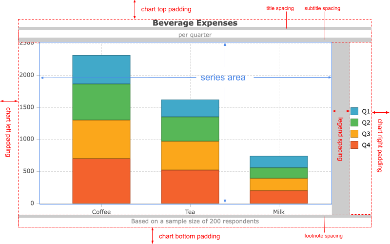

This section explains the components of a chart and how they are laid out inside a chart.

## How is the chart layout calculated?

Each chart is composed of a single or multiple series, and optionally a legend, axes, and captions, such as title and subtitle. All of these components are managed by the chart's layout engine. They are sized and positioned appropriately based on the chart's dimensions, the nature of the data and the configuration.

Components are laid out in the following order; earlier elements take up space that is then unavailable for the layout
of later elements:
- Chart padding
- Title plus its configured spacing
- Sub-title plus its configured spacing
- Legend plus its configured spacing
- Navigator plus its configured margin
- Axes
- Series area

If any elements are hidden (not configured, or turned off explicitly or dynamically) then they do not consume any space
during layout processing.

### Chart Padding

`padding` configuration is applied first, ensuring a clear boundary of all other components from the edge of the canvas.
Space is consumed on all sides of the available area based upon the `padding` configuration.

### Title

`title` configuration applies next, horizontally centring on the remaining space and consuming the
height of the title and its additional `title.spacing`.

### Sub-Title

`subtitle` configuration applies next, horizontally centring on the remaining space and consuming the
height of the title and its additional `subtitle.spacing`.

### Legend

`legend` configuration is applied to the remaining space. The exact space consumed depends on how the
[legend](/charts-legend/) is configured.

`legend.spacing` can be used to adjust the space between the legend and later components.

### Navigator

`navigator` configuration is applied next. The exact space consumed depends on how the
[navigator](/charts-navigator/) is configured.

`navigator.margin` can be used to adjust the space between the navigator and later components.

### Axes

`axes` layout is then calculated based upon the remaining space and how the [axes](/charts-axes/) are
configured.

### Series Area

All remaining space is then dedicated to rendering of the configured `series` options.

## Size Changes

When the chart size changes, the layout process is performed for the new available canvas space.
Most components are typically a fixed size, so typically it is the series-area which shrinks or grows
and most other components just move around or adjust alignment.

By default, the chart will resize automatically to fill the container element. If either the `width` or `height` configs are set, auto-sizing will be disabled unless the `autoSize` config is explicitly set to `true`.

Make sure to give the chart's `container` element an explicit size, otherwise you will run into a chicken and egg situation where the container expects to size itself according to the content and the chart expects to size itself according to the container.

## Next Up

Continue to the next section to learn about the [legend and its layout](/charts-legend/).
