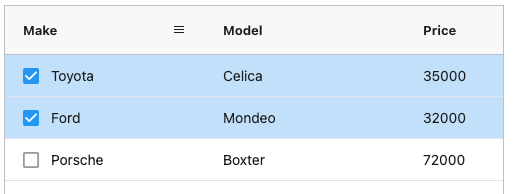

<style>
    .gatsby-resp-image-wrapper {
        margin-left: 0 !important;
        margin-right: 0 !important;
        margin-bottom: 1rem;
    }
    .gatsby-resp-image-image {
        box-shadow: none !important;
    }

    .code-tab pre {
        margin-top: 0;
    }

    .code-tab .nav-item {
        margin-bottom: 0 !important;
    }
</style>

[[only-javascript]]
| AG Grid is the industry standard for JavaScript Enterprise Applications. Developers using
| AG Grid are building applications that would not be possible if AG Grid did not exist.

[[only-angular]]
| AG Grid is the industry standard for Angular Enterprise Applications. Developers using AG Grid are
| building applications that would not be possible if AG Grid did not exist.

[[only-react]]
| AG Grid is the industry standard for React Enterprise Applications. Developers using AG Grid
| are building applications that would not be possible if AG Grid did not exist.

[[only-vue]]
| AG Grid is the industry standard for Vue Enterprise Applications. Developers using AG Grid
| are building applications that would not be possible if AG Grid did not exist.


<section class="code-tab mb-3">
<div class="card">
<div class="card-header">Quick Look Code Example</div>
<div class="card-body">
<ul class="nav nav-tabs">
<li class="nav-item">
<a  class="nav-link active" id="component-tab" data-toggle="tab" href="#component" role="tab" aria-controls="component" aria-selected="true">

[[only-javascript]]
| main.js

[[only-angular]]
| app.component.ts

[[only-react]]
| index.js

[[only-vue]]
| App.vue

</a>
</li>
<li class="nav-item">
<a class="nav-link" id="template-tab" data-toggle="tab" href="#template" role="tab" aria-controls="template" aria-selected="false">

[[only-javascript]]
| index.html

[[only-angular]]
| app.component.html

[[only-react]]
| index.html

[[only-vue]]
| index.js

</a>
</li>
</ul>
<div class="tab-content">
<div class="tab-pane show active" id="component" role="tabpanel" aria-labelledby="component-tab">

[[only-javascript]]
| ```js
| const columnDefs = [
|   { field: "make" },
|   { field: "model" },
|   { field: "price" }
| ];
|
| // specify the data
| const rowData = [
|   { make: "Toyota", model: "Celica", price: 35000 },
|   { make: "Ford", model: "Mondeo", price: 32000 },
|   { make: "Porsche", model: "Boxter", price: 72000 }
| ];
|
| // let the grid know which columns and what data to use
| const gridOptions = {
|   columnDefs: columnDefs,
|   rowData: rowData
| };
|
| // setup the grid after the page has finished loading
| document.addEventListener('DOMContentLoaded', () => {
|     const gridDiv = document.querySelector('#myGrid');
|     new agGrid.Grid(gridDiv, gridOptions);
| });
| ```

[[only-angular]]
| ```ts
| import { Component } from '@angular/core';
| import { ColDef } from 'ag-grid-community';
|
| @Component({
|   selector: 'my-app',
|   templateUrl: './app.component.html',
|   styleUrls: [ './app.component.scss' ]
| })
| export class AppComponent  {
|
|     columnDefs: ColDef[] = [
|         { field: 'make' },
|         { field: 'model' },
|         { field: 'price' }
|     ];
|
|     rowData = [
|         { make: 'Toyota', model: 'Celica', price: 35000 },
|         { make: 'Ford', model: 'Mondeo', price: 32000 },
|         { make: 'Porsche', model: 'Boxter', price: 72000 }
|     ];
|
| }
| ```

[[only-react]]
| ```jsx
| import React, { useState } from 'react';
| import { render } from 'react-dom';
| import { AgGridReact } from 'ag-grid-react';
| 
| import 'ag-grid-community/dist/styles/ag-grid.css';
| import 'ag-grid-community/dist/styles/ag-theme-alpine.css';
| 
| const App = () => {
|    const [rowData] = useState([
|        {make: "Toyota", model: "Celica", price: 35000},
|        {make: "Ford", model: "Mondeo", price: 32000},
|        {make: "Porsche", model: "Boxter", price: 72000}
|    ]);
|    
|    const [columnDefs] = useState([
|        { field: 'make' },
|        { field: 'model' },
|        { field: 'price' }
|    ])
|
|    return (
|        <div className="ag-theme-alpine" style={{height: 400, width: 600}}>
|            <AgGridReact
|                rowData={rowData}
|                columnDefs={columnDefs}>
|            </AgGridReact>
|        </div>
|    );
| };
| 
| render(<App />, document.getElementById('root'));
| ```

[[only-vue]]
| ```jsx
| <template>
|   <ag-grid-vue
|     style="width: 500px; height: 200px"
|     class="ag-theme-alpine"
|     :columnDefs="columnDefs"
|     :rowData="rowData"
|   >
|   </ag-grid-vue>
| </template>
| 
| <script>
| import "ag-grid-community/dist/styles/ag-grid.css";
| import "ag-grid-community/dist/styles/ag-theme-alpine.css";
| import { AgGridVue } from "ag-grid-vue";
| 
| export default {
|   name: "App",
|   data() {
|     return {
|       columnDefs: null,
|       rowData: null,
|     };
|   },
|   components: {
|     AgGridVue,
|   },
|   beforeMount() {
|     this.columnDefs = [
|       { field: "make" },
|       { field: "model" },
|       { field: "price" },
|     ];
| 
|     this.rowData = [
|       { make: "Toyota", model: "Celica", price: 35000 },
|       { make: "Ford", model: "Mondeo", price: 32000 },
|       { make: "Porsche", model: "Boxter", price: 72000 },
|     ];
|   },
| };
| </script>
| ```

</div>
<div class="tab-pane" id="template" role="tabpanel" aria-labelledby="template-tab">

[[only-javascript]]
| ```html
| <!DOCTYPE html>
| <html lang="en">
| <head>
|     <title>Ag-Grid Basic Example</title>
|     <script src="https://unpkg.com/ag-grid-community/dist/ag-grid-community.min.js"></script>
|     <script src="main.js"></script>
| </head>
| <body>
|     <div id="myGrid" style="height: 200px; width:500px;" class="ag-theme-alpine"></div>
| </body>
| </html>
| ```

[[only-angular]]
| ```html
| <ag-grid-angular
|     style="width: 500px; height: 150px;"
|     class="ag-theme-alpine"
|     [rowData]="rowData"
|     [columnDefs]="columnDefs">
| </ag-grid-angular>
| ```

[[only-react]]
| ```html
| <div id="root"></div>
| ```

[[only-vue]]
| ```jsx
| import Vue from 'vue';
| import { App } from './app';
|
| new Vue({
|   el: '#root',
|   render: h => h(App)
| });
| ```

</div>
</div>
</div>
<div class="text-right" style="margin-top: -1.5rem;">

[[only-javascript]]
| <a class="btn btn-dark mb-2 mr-3" href="https://plnkr.co/edit/nmWxAxWONarW5gj2?p=preview?p=preview" target="_blank">
|     Open in  Plunker
| </a>

[[only-angular]]
| <a class="btn btn-dark mb-2 mr-3" href="https://stackblitz.com/edit/ag-grid-angular-hello-world" target="_blank">
|     Open in  StackBlitz
| </a>

[[only-react]]
| <a class="btn btn-dark mb-2 mr-3" href="https://stackblitz.com/edit/ag-grid-react-hello-world" target="_blank">
|     Open in  StackBlitz
| </a>


[[only-vue]]
| <a class="btn btn-dark mb-2 mr-3" href="https://codesandbox.io/s/ag-grid-vue-example-xu6c4?file=/src/App.vue" target="_blank">
|     Open in CodeSandbox
| </a>

</div>
</div>
</section>


[[only-javascript]]
| ## Getting Started
|
| <video-section id="KS-wg5zfCXc" title="Getting Started Video Tutorial">
|     In this article, we will walk you through the necessary steps to add AG Grid to an existing JavaScript
|     project, and configure some of the essential features of it. We will show you some of the fundamentals
|     of the grid (passing properties, using the API, etc).
| </video-section>
|
| ## The Project Setup
|
| During the last couple of years, we are witnessing a Cambrian Explosion of JavaScript project stacks.
| It seems like everyday there is a new, better way for JavaScript developers to build and distribute their apps.
| However,  for the purposes of this setup, we are going to stick to tried-and-true no-build, single HTML file setup
| which loads the AG Grid scripts from CDN (our favorite one is [unpkg](https://unpkg.com/)). Let's start from
| this clean html file:
|
| ```html
| <!DOCTYPE html>
| <html>
|   <head>
|   </head>
|   <body>
|     <h1>Hello from AG Grid!</h1>
|   </body>
| </html>
| ```
|
| [[note]]
| | You can either use your favorite programming text editor, or you can execute the steps in the
| | tutorial using [this Plunker as a starting point](https://plnkr.co/edit/nmWxAxWONarW5gj2?p=preview).
|
| ## Add AG Grid to Your Project
|
| We are going to load the necessary scripts and styles from the unpkg CDN. Add the following to the `head` element:
|
| ```html
| <!DOCTYPE html>
| <html>
|   <head>
|     <script src="https://unpkg.com/ag-grid-community/dist/ag-grid-community.min.noStyle.js"></script>
|     <link rel="stylesheet" href="https://unpkg.com/ag-grid-community/dist/styles/ag-grid.css">
|     <link rel="stylesheet" href="https://unpkg.com/ag-grid-community/dist/styles/ag-theme-alpine.css">
|   </head>
|   <body>
|     <h1>Hello from AG Grid!</h1>
|   </body>
| </html>
| ```
|
| The lines above import the `AgGrid` component, the grid "structure" stylesheet (`ag-grid.css`), and one
| of the available grid themes: (`ag-theme-alpine.css`). The grid ships several different themes; pick one
| that matches your project design.
|
| Now, let's instantiate a grid!
|
| ```html
| <!DOCTYPE html>
| <html>
| <head>
|   <script src="https://unpkg.com/ag-grid-community/dist/ag-grid-community.min.noStyle.js"></script>
|   <link rel="stylesheet" href="https://unpkg.com/ag-grid-community/dist/styles/ag-grid.css">
|   <link rel="stylesheet" href="https://unpkg.com/ag-grid-community/dist/styles/ag-theme-alpine.css">
| </head>
| <body>
|   <h1>Hello from AG Grid!</h1>
|
|   <div id="myGrid" class="ag-theme-alpine" style="height: 600px; width:500px;"></div>
|
|   <script type="text/javascript" charset="utf-8">
|     // specify the columns
|     const columnDefs = [
|       { field: "make" },
|       { field: "model" },
|       { field: "price" }
|     ];
|
|     // specify the data
|     const rowData = [
|       { make: "Toyota", model: "Celica", price: 35000 },
|       { make: "Ford", model: "Mondeo", price: 32000 },
|       { make: "Porsche", model: "Boxter", price: 72000 }
|     ];
|
|     // let the grid know which columns and what data to use
|     const gridOptions = {
|       columnDefs: columnDefs,
|       rowData: rowData
|     };
|
|   // lookup the container we want the Grid to use
|   const eGridDiv = document.querySelector('#myGrid');
|
|   // create the grid passing in the div to use together with the columns & data we want to use
|   new agGrid.Grid(eGridDiv, gridOptions);
|
|   </script>
| </body>
| </html>
| ```
|
| The variables above present two essential configuration properties of the grid -
| <a href="../column-definitions/" target="_blank">the column definitions</a>
| (`columnDefs`) and the data (`rowData`). In our case, the column definitions contain three columns; each
| column entry specifies the header label and the data field to be displayed in the body of the table.
|
| The actual data is defined in the `rowData` as an array of objects. Notice that the fields of the objects
| match the `field` values in the `columnDefs` configuration object.
|
| Finally, the `DIV` element is the DOM entry point of the grid. It sets the grid dimensions and specifies the
| grid's theme by setting the `class` to `ag-theme-alpine`. As you may have already noticed, the CSS class
| matches the name of CSS file we imported earlier.
|
| 
|
| ## Enable Sorting And Filtering
|
| So far, so good. But wouldn't it be nice to be able to sort the data to help us see which car is the least/most
| expensive Well, enabling sorting in AG Grid is actually quite simple - all you need to do is add `sortable` to
| each column.
|
| ```js
| const columnDefs = [
|     { field: "make", sortable: true },
|     { field: "model", sortable: true },
|     { field: "price", sortable: true }
| ];
| ```
|
| After adding the property, you should be able to sort the grid by clicking on the column headers. Clicking on
| a header toggles through ascending, descending and no-sort.
|
| Our application doesn't have too many rows, so it's fairly easy to find data. But it's easy to imagine how
| a real-world application may have hundreds (or even hundreds of thousands!) of rows, with many columns. In a
| data set like this filtering is your friend.
|
| As with sorting, enabling filtering is as easy as adding the `filter` property:
|
| ```js
| const columnDefs = [
|     { field: "make", sortable: true, filter: true },
|     { field: "model", sortable: true, filter: true },
|     { field: "price", sortable: true, filter: true }
| ];
| ```
|
| With this property set, the grid will display a small column menu icon when you hover the header. Pressing
| it will display a popup with a filtering UI which lets you choose the kind of filter and the text that you
| want to filter by.
|
| 
|
| ## Fetch Remote Data
|
| Displaying hard-coded data in JavaScript is not going to get us very far. In the real world, most of the
| time, we are dealing with data that resides on a remote server. Nowadays, implementing this is actually
| quite simple. Notice that the actual data fetching is performed outside of the grid component - we are
| using the HTML5 `fetch` API.
|
| [[note]]
| | If you have to support older browsers but you want to use fetch, you can add
| | [the appropriate polyfill](https://github.com/github/fetch).
|
| ```html
| <!DOCTYPE html>
| <html>
| <head>
|   <script src="https://unpkg.com/ag-grid-community/dist/ag-grid-community.min.noStyle.js"></script>
|   <link rel="stylesheet" href="https://unpkg.com/ag-grid-community/dist/styles/ag-grid.css">
|   <link rel="stylesheet" href="https://unpkg.com/ag-grid-community/dist/styles/ag-theme-alpine.css">
| </head>
| <body>
|   <h1>Hello from AG Grid!</h1>
|
|   <div id="myGrid" style="height: 600px;width:500px;" class="ag-theme-alpine"></div>
|
|   <script type="text/javascript" charset="utf-8">
|     // specify the columns
|     const columnDefs = [
|       { field: "make" },
|       { field: "model" },
|       { field: "price" }
|     ];
|
|     // let the grid know which columns to use
|     const gridOptions = {
|       columnDefs: columnDefs
|     };
|
|   // lookup the container we want the Grid to use
|   const eGridDiv = document.querySelector('#myGrid');
|
|   // create the grid passing in the div to use together with the columns & data we want to use
|   new agGrid.Grid(eGridDiv, gridOptions);
|
|   // fetch the row data to use and one ready provide it to the Grid via the Grid API
|   fetch('https://www.ag-grid.com/example-assets/small-row-data.json')
|       .then(response => response.json())
|       .then(data => {
|           gridOptions.api.setRowData(data);
|       });
|
|   </script>
| </body>
| </html>
| ```
|
| Here, we replaced the `rowData` assignment  with a data fetch from a remote service. The remote data is the
| same as the one we initially had, so you should not notice any actual changes to the grid.
|
| Notice that we also did something new - we accessed the [grid API](/grid-api/) instance through the
| `gridOptions.api`. The api object exposes a whole plethora of methods that allow us to implement complex scenarios
| with the grid.
|
| ## Enable Selection
|
| Being a programmer is a hectic job. Just when we thought that we are done with our assignment, the manager
| shows up with a fresh set of requirements!
| It turned out that we need to allow the user to select certain rows from the grid and to mark them as
| flagged in the system.
| We will leave the flag toggle state and persistence to the backend team. On our side, we should enable the
| selection and, afterwards, to obtain the selected records and pass them with an API call to a remote service endpoint.
|
| Fortunately, the above task is quite simple with AG Grid. As you may have already guessed, it is just a
| matter of adding and changing couple of properties:
|
| ```js
| // specify the columns
| const columnDefs = [
|   { field: "make", checkboxSelection: true },
|   { field: "model" },
|   { field: "price" }
| ];
|
| // let the grid know which columns and what data to use
| const gridOptions = {
|   columnDefs: columnDefs,
|   rowSelection: 'multiple'
| };
| ```
|
| Great! Now the first column contains a checkbox that, when clicked, selects the row. The only thing we have
| to add is a button that gets the selected data and sends it to the server. To do this, we need the following
| change:
|
| ```html
|<button onclick="getSelectedRows()">Get Selected Rows</button>
|<div id="myGrid" class="ag-theme-alpine" style="height: 600px; width:500px;"></div>
| ```
|
| ```js
| const getSelectedRows = () => {
|     const selectedNodes = gridOptions.api.getSelectedNodes()
|     const selectedData = selectedNodes.map( node => node.data )
|     const selectedDataStringPresentation = selectedData.map( node => `${node.make} ${node.model}`).join(', ')
|     alert(`Selected nodes: ${selectedDataStringPresentation}`);
| }
| ```
|
| Well, we cheated a bit. Calling `alert` is not exactly a call to our backend. Hopefully you will forgive us
| this shortcut for the sake of keeping the article short and simple. Of course, you can substitute that bit
| with a real-world application logic after you are done with the tutorial.
|
| What happened above? Several things:
|
| - We added a button with an event handler;
| - Inside the event handler, we accessed the grid API to get the currently selected grid row nodes;
| - Afterwards, we extracted the row nodes' underlying data items and converted them to a string suitable to be
| presented to the user in an alert box.
|
| ## Grouping (enterprise)
|
| [[note]]
| | Grouping is a feature exclusive to AG Grid Enterprise. You are free to trial AG Grid Enterprise to see what
| | you think - you only need to get in touch if you want to start using AG Grid Enterprise in a project intended
| | for production.
|
| In addition to filtering and sorting, [grouping](/grouping/) is another effective way for the user to make
| sense out of large amounts of data.
|
| Let's enable the enterprise features of ag-grid. Install the additional package:
|
| Now, let's use ag-grid-enterprise! Replace the ag-grid script reference in the `head` with this one:
|
| ```diff
| <head>
|     <title>Ag-Grid Basic Example</title>
| -   <script src="https://unpkg.com/ag-grid-community/dist/ag-grid-community.min.js"></script>
| +   <script src="https://unpkg.com/ag-grid-enterprise/dist/ag-grid-enterprise.min.noStyle.js"></script>
|     <script src="main.js"></script>
| </head>
| ```
|
| If everything is ok, you should see a message in the console that tells you there is no enterprise license key.
| You can ignore the message as we are simply trialing AG Grid Enterprise for the time being. 
| In addition to that, the grid got a few UI improvements - a custom
| context menu and fancier column menu popup - feel free to look around:
|
| 
|
| Now let's enable grouping! Change the configuration to this:
|
| ```js
| const columnDefs = [
|     { field: "make", rowGroup: true },
|     { field: "price" }
| ];
|
| const autoGroupColumnDef = {
|     headerName: "Model",
|     field: "model",
|     cellRenderer:'agGroupCellRenderer',
|     cellRendererParams: {
|         checkbox: true
|     }
| }
|
| // let the grid know which columns and what data to use
| const gridOptions = {
|     columnDefs: columnDefs,
|     autoGroupColumnDef: autoGroupColumnDef,
|     groupSelectsChildren: true,
|     rowSelection: 'multiple'
| };
| ```
|
| There we go! The grid now groups the data by `make`, while listing the `model` field value when expanded.
| Notice that grouping works with checkboxes as well - the `groupSelectsChildren` property adds a group-level
| checkbox that selects/deselects all items in the group.
|
| [[note]]
| | Don't worry if this step feels a bit overwhelming - the  grouping feature is very powerful and supports
| | complex interaction scenarios which you might not need initially. The grouping documentation section
| | contains plenty of real-world runnable examples that can get you started for your particular  case.
|
| This is how the final code should look:
|
| ```html
| <!DOCTYPE html>
| <html>
| <head>
|   <script src="https://unpkg.com/ag-grid-enterprise/dist/ag-grid-enterprise.min.noStyle.js"></script>
|   <link rel="stylesheet" href="https://unpkg.com/ag-grid-community/dist/styles/ag-grid.css">
|   <link rel="stylesheet" href="https://unpkg.com/ag-grid-community/dist/styles/ag-theme-alpine.css">
| </head>
| <body>
|   <h1>Hello from AG Grid!</h1>
|   <button onclick="getSelectedRows()">Get Selected Rows</button>
|   <div id="myGrid" style="height: 600px;width:500px;" class="ag-theme-alpine"></div>
|
|   <script type="text/javascript" charset="utf-8">
|        // specify the columns
|        const columnDefs = [
|            { field: "make", rowGroup: true },
|            { field: "price" }
|        ];
|        
|        const autoGroupColumnDef = {
|            headerName: "Model",
|            field: "model",
|            cellRenderer:'agGroupCellRenderer',
|            cellRendererParams: {
|                checkbox: true
|            }
|        }
|        
|        // let the grid know which columns and what data to use
|        const gridOptions = {
|            columnDefs: columnDefs,
|            autoGroupColumnDef: autoGroupColumnDef,
|            groupSelectsChildren: true,
|            rowSelection: 'multiple'
|        };
|        
|        // lookup the container we want the Grid to use
|        const eGridDiv = document.querySelector('#myGrid');
|        
|        // create the grid passing in the div to use together with the columns & data we want to use
|        new agGrid.Grid(eGridDiv, gridOptions);
|        
|        fetch('https://www.ag-grid.com/example-assets/small-row-data.json')
|            .then(response => response.json())
|            .then(data => {
|               gridOptions.api.setRowData(data);
|            });
|        
|        const getSelectedRows = () => {
|            const selectedNodes = gridOptions.api.getSelectedNodes()
|            const selectedData = selectedNodes.map( node => node.data )
|            const selectedDataStringPresentation = selectedData.map( node => `${node.make} ${node.model}` ).join(', ')
|            alert('Selected nodes: ' + selectedDataStringPresentation);
|        }
|   </script>
| </body>
| </html>
| ```
|
| ## Summary
|
| With this Javascript datagrid tutorial, we managed to accomplish a lot. Starting from the humble beginnings
| of a three row / column setup, we now have a grid that supports sorting, filtering, binding to remote data,
| selection and even grouping! While doing so, we learned how to configure the grid and how how to use its api
| object to call methods.
|
| ## Next Steps
|
| The best thing you can check after the Javascript grid tutorial is the [features overview](/grid-features/).
| It provides an extensive review of what you can achieve with AG Grid. In addition, you can go through the
| following help articles to learn more about the features we enabled:
| <style>
|    .btn.btn-outline-primary:hover {
|        color: #fff;
|    }
| </style>
| <div>
|   <a class="btn btn-outline-primary" href="../row-sorting/" role="button">Row Sorting</a>
|   <a class="btn btn-outline-primary" href="../filtering/" role="button">Filtering</a>
|   <a class="btn btn-outline-primary" href="../grouping/" role="button">Grouping</a>
|   <a class="btn btn-outline-primary" href="../row-selection/" role="button">Selection</a>
| </div>


[[only-angular]]
| [[note]]
| | Please refer to our [Compatibility Chart](#ag-grid--angular-compatibility-chart) for Supported Versions of
| | Angular & AG Grid.
|
| ## Getting Started
|
| <video-section id="AeEfiWAGyLc" title="Getting Started Video Tutorial">
|     Below we walk through the necessary steps to add AG Grid (both
|     <a href="../licensing/">Community and Enterprise</a> are covered) to an
|     Angular project and configure some grid features. In particular, we will go through
|     the following steps:
|  </video-section>
|
| 1. [Add AG Grid to Your Project](#add-ag-grid-to-your-project-1)
| 1. [Enable Sorting and Filtering](#enable-sorting-and-filtering-1)
| 1. [Fetch Remote Data](#fetch-remote-data-1)
| 1. [Enable Selection](#enable-selection-1)
| 1. [Grouping (Enterprise)](#grouping-1)
| 1. [Customise the Theme Look](#customise-the-theme-look)
| 1. [Summary](#summary-1)
|
| [[note]]
| | <div id="thinkster-note" style="display: flex;">
| |     <span style="display: inline-block; width: 150px; background: radial-gradient(#41a3ff, #0273D4); border-radius: 5px; padding: 3px;">
| |         <a href="https://thinkster.io/topics/ag-grid" target="_blank">
| |             
| |         </a>
| |     </span>
| |     <span style="flex-grow: 1; display: flex; align-items: center; padding-left: 10px;">
| |         Thinkster has provided a free course:&nbsp;
| |         <a href="https://thinkster.io/topics/ag-grid" target="_blank">Learning AG Grid with Angular</a>
| |     </span>
| | </div>
|
|
| ## Add AG Grid to Your Project
|
| For the purposes of this tutorial, we are going to scaffold an Angular app with
| [angular CLI](https://cli.angular.io/). Don't worry if your project has a different
| configuration. AG Grid and its Angular wrapper are distributed as NPM packages, which
| should work with any common Angular project module bundler setup. Let's follow the
| [Angular CLI instructions](https://github.com/angular/angular-cli#installation) - run the
| following in your terminal:
|
|
| ```bash
| npx -p @angular/cli@latest ng new my-app  --style scss --routing false
| cd my-app
| npm start
| ```
|
| [[note]]
| | We are passing `--style scss` to the app scaffolding command so that we may customise the
| | grid theme look through Sass variables.
|
| If everything goes well, `ng serve` has started the web server. You can open your app at
| <a href="http://localhost:4200" target="_blank">localhost:4200</a>.
|
| As a next step, let's add the AG Grid NPM packages. run the following command in `my-app` (you may need a new instance of | the terminal):
|
| ```bash
| npm install --save ag-grid-community ag-grid-angular
| npm install # in certain circumstances npm will perform an "auto prune". This step ensures all expected dependencies are | present
| ```
|
| After a few seconds of waiting, you should be good to go. Let's get to the actual coding! As a first
| step, let's add the AG Grid Angular module to our app module (`src/app/app.module.ts`):
|
| ```ts
| import { BrowserModule } from '@angular/platform-browser';
| import { NgModule } from '@angular/core';
|
| import { AppComponent } from './app.component';
| import { AgGridModule } from 'ag-grid-angular';
|
| @NgModule({
|   declarations: [AppComponent],
|   imports: [
|     BrowserModule,
|     AgGridModule.withComponents([])
|   ],
|   providers: [],
|   bootstrap: [AppComponent]
| })
| export class AppModule {}
| ```
|
| [[note]]
| | The `withComponents` call is only necessary for Angular <= v8 or if Ivy has been disabled (`enableIvy:false`). If this is the case you must use `withComponents` to enable the grid to use Angular
| | components as cells / headers  otherwise you can ignore it and just import `AgGridModule`.
|
| The next step is to add the AG Grid styles - replace the content of
| `src/styles.scss` with the following code:
|
| ```scss
| @import "ag-grid-community/dist/styles/ag-grid.css";
| @import "ag-grid-community/dist/styles/ag-theme-alpine.css";
| ```
|
| The code above imports the grid "structure" stylesheet (`ag-grid.css`), and one of the
| available grid themes: (`ag-theme-alpine.css`). The grid ships several different themes; pick one
| that matches your project design. You can customise it further with Sass variables, a technique
| which we will cover further down the road.
|
| Next, let's declare the basic grid configuration. Edit `src/app/app.component.ts`:
|
| ```ts
| import { Component } from '@angular/core';
| import { ColDef } from 'ag-grid-community';
|
| @Component({
|     selector: 'app-root',
|     templateUrl: './app.component.html',
|     styleUrls: ['./app.component.scss']
| })
| export class AppComponent {
|
|     columnDefs: ColDef[] = [
|         { field: 'make' },
|         { field: 'model' },
|         { field: 'price'}
|     ];
|
|     rowData = [
|         { make: 'Toyota', model: 'Celica', price: 35000 },
|         { make: 'Ford', model: 'Mondeo', price: 32000 },
|         { make: 'Porsche', model: 'Boxter', price: 72000 }
|     ];
| }
| ```
|
| The code above presents two essential configuration properties of the grid -
| [the column definitions](/column-definitions/)
| (`columnDefs`) and the data (`rowData`). In our case, the column definitions contain three columns;
| each column entry specifies the header label and the data field to be displayed in the body of the table.
|
| Finally, let's add the component definition to our template. Edit `app/app.component.html` and remove the scaffold code:
|
| ```html
| <ag-grid-angular
|     style="width: 500px; height: 500px;"
|     class="ag-theme-alpine"
|     [rowData]="rowData"
|     [columnDefs]="columnDefs"
| >
| </ag-grid-angular>
| ```
|
| This is the ag-grid component definition, with two property bindings - `rowData` and `columnDefs`.
| The component also accepts the standard DOM `style` and `class`. We have set the class to `ag-theme-alpine`,
| which defines the grid theme. As you may have already noticed, the CSS class matches the name of CSS
| file we imported earlier.
|
| If everything works as expected, you should see a simple grid like the one on the screenshot:
|
| 
|
| ## Enable Sorting And Filtering
|
| So far, so good. But wouldn't it be nice to be able to sort the data to help us see which car is the
| least/most expensive? Well, enabling sorting in AG Grid is actually quite simple - all you
| need to do is set the `sortable` property to each column you want to be able to sort by.
|
| ```ts
| columnDefs: ColDef[] = [
|     { field: 'make', sortable: true },
|     { field: 'model', sortable: true },
|     { field: 'price', sortable: true }
| ];
| ```
|
| After adding the property, you should be able to sort the grid by clicking on the column
| headers. Clicking on a header toggles through ascending, descending and no-sort.
|
| Our application doesn't have too many rows, so it's fairly easy to find data. But it's easy to
| imagine how a real-world application may have hundreds (or even hundreds of thousands!) of
| rows, with many columns. In a data set like this [filtering](/filtering/)
| is your friend.
|
| As with sorting, enabling filtering is as easy as setting the `filter` property:
|
| ```ts
| columnDefs: ColDef[] = [
|     { field: 'make', sortable: true, filter: true },
|     { field: 'model', sortable: true, filter: true },
|     { field: 'price', sortable: true, filter: true }
| ];
| ```
|
| With this property set, the grid will display a small column menu icon when you hover the header. Pressing
| it will display a popup with a filtering UI which lets you choose the kind of filter and the text that
| you want to filter by.
|
| 
|
| ## Fetch Remote Data
|
| Displaying hard-coded data in JavaScript is not going to get us very far. In the real world,
| most of the time, we are dealing with data that resides on a remote server. Thanks to Angular,
| implementing this is actually quite simple. Notice that the actual data fetching is performed
| outside of the grid component - we are using Angular's [HttpClient](https://angular.io/guide/http)
| and an async pipe. As a first step, let's add the `HttpModule` to our app module:
|
| ```ts
| import { BrowserModule } from '@angular/platform-browser';
| import { NgModule } from '@angular/core';
|
| import { AppComponent } from './app.component';
| import { AgGridModule } from 'ag-grid-angular';
| import { HttpClientModule } from '@angular/common/http';
|
| @NgModule({
|   declarations: [AppComponent],
|   imports: [
|     BrowserModule,
|     HttpClientModule,
|     AgGridModule.withComponents([])
|   ],
|   providers: [],
|   bootstrap: [AppComponent]
| })
| export class AppModule {}
| ```
|
| Now, let's remove the hard-coded data and fetch it from a remote server.
| Edit the `src/app/app.component.ts` to this:
|
|```ts
|import { Component } from '@angular/core';
|import { HttpClient } from '@angular/common/http';
|import { Observable } from 'rxjs';
|import { ColDef } from 'ag-grid-community';
|
|@Component({
|    selector: 'app-root',
|    templateUrl: './app.component.html',
|    styleUrls: ['./app.component.scss']
|})
|export class AppComponent {
|
|    columnDefs: ColDef[] = [
|        { field: 'make', sortable: true, filter: true },
|        { field: 'model', sortable: true, filter: true },
|        { field: 'price', sortable: true, filter: true }
|    ];
|
|    rowData: Observable<any[]>;
|
|    constructor(private http: HttpClient) {
|        this.rowData = this.http.get<any[]>('https://www.ag-grid.com/example-assets/small-row-data.json');
|    }
|}
|```
|
| The above code turns the `rowData` from a hard-coded array to an `Observable`. For the grid to work with
| it, we need to add an async pipe to the property:
|
| ```html
| <ag-grid-angular
|     style="width: 500px; height: 500px;"
|     class="ag-theme-alpine"
|     [rowData]="rowData | async"
|     [columnDefs]="columnDefs"
| >
| </ag-grid-angular>
| ```
|
| The remote data is the same as the one we initially had, so you should not notice any actual changes
| to the grid. However, you will see an additional HTTP request performed if you open your developer tools.
|
| ## Enable Selection
|
| Being a programmer is a hectic job. Just when we thought that we are done with our assignment, the manager
| shows up with a fresh set of requirements! It turned out that we need to allow the user to select certain
| rows from the grid and to mark them as flagged in the system. We will leave the flag toggle state and
| persistence to the backend team. On our side, we should enable the selection and, afterwards, to obtain
| the selected records and pass them with an API call to a remote service endpoint.
|
| Fortunately, the above task is quite simple with AG Grid. As you may have already guessed, it is just a
| matter of adding and changing couple of properties. Edit `src/app/app.component.ts` first:
|
| ```ts
|import { Component } from '@angular/core';
|import { HttpClient } from '@angular/common/http';
|import { Observable } from 'rxjs';
|import { ColDef } from 'ag-grid-community';
|
|@Component({
|    selector: 'app-root',
|    templateUrl: './app.component.html',
|    styleUrls: ['./app.component.scss']
|})
|export class AppComponent {
|
|    columnDefs: ColDef[] = [
|        {field: 'make', sortable: true, filter: true, checkboxSelection: true},
|        {field: 'model', sortable: true, filter: true},
|        {field: 'price', sortable: true, filter: true}
|    ];
|
|    rowData: Observable<any[]>;
|
|    constructor(private http: HttpClient) {
|       this.rowData = this.http.get<any[]>('https://www.ag-grid.com/example-assets/small-row-data.json');
|    }
|}
| ```
|
| Next, let's enable [multiple row selection](/row-selection/#example-multiple-row-selection),
| so that the user can pick many rows:
|
| ```html
| <ag-grid-angular
|     style="width: 500px; height: 500px;"
|     class="ag-theme-alpine"
|     [rowData]="rowData | async"
|     [columnDefs]="columnDefs"
|     rowSelection="multiple"
| >
| </ag-grid-angular>
| ```
|
| Great! Now the first column contains a checkbox that, when clicked, selects the row. The only
| thing we have to add is a button that gets the selected data and sends it to the server. To do this,
| we are going to use the [AG Grid API](/grid-api/) - we will access
| it through the component instance. To access to component instance we will need to add the
| `#agGrid` id to our component.
|
| ```html
| <button (click)="getSelectedRows()">Get Selected Rows</button>
| <ag-grid-angular
|     #agGrid
|     style="width: 500px; height: 500px;"
|     class="ag-theme-alpine"
|     [rowData]="rowData | async"
|     [columnDefs]="columnDefs"
|     rowSelection="multiple"
| >
| </ag-grid-angular>
| ```
|
| Now let's make the instance accessible, and add the `getSelectedRows` method to our component: 
|
|```diff
|+ import { Component, ViewChild } from '@angular/core';
|import { HttpClient } from '@angular/common/http';
|import { Observable } from 'rxjs';
|import { ColDef } from 'ag-grid-community';
|+ import { AgGridAngular } from 'ag-grid-angular';
|
|@Component({
|    selector: 'app-root',
|    templateUrl: './app.component.html',
|    styleUrls: ['./app.component.scss']
|})
|export class AppComponent {
|+  @ViewChild('agGrid') agGrid!: AgGridAngular;
|
|    columnDefs: ColDef[] = [
|        {field: 'make', sortable: true, filter: true, checkboxSelection: true},
|        {field: 'model', sortable: true, filter: true},
|        {field: 'price', sortable: true, filter: true}
|    ];
|
|    rowData: Observable<any[]>;
|
|    constructor(private http: HttpClient) {
|       this.rowData = this.http.get<any[]>('https://www.ag-grid.com/example-assets/small-row-data.json');
|    }
|
|+  getSelectedRows(): void {
|+      const selectedNodes = this.agGrid.api.getSelectedNodes();
|+      const selectedData = selectedNodes.map(node => node.data);
|+      const selectedDataStringPresentation = selectedData.map(node => `${node.make} ${node.model}`).join(', ');
|+
|+      alert(`Selected nodes: ${selectedDataStringPresentation}`);
|+   }
|}
|```
|
| Well, we cheated a bit - calling `alert` is not exactly a call to our backend.
| Hopefully you will forgive us this shortcut for the sake of keeping the article short and
| simple. Of course, you can substitute that bit with a real-world application logic after you
| are done with the tutorial.
|
| ## Grouping (enterprise)
|
| [[note]]
| | Grouping is a feature exclusive to AG Grid Enterprise. You are free to trial AG Grid Enterprise
| | to see what you think. You only need to get in touch if you want to start using AG Grid Enterprise
| | in a project intended for production.
|
| In addition to filtering and sorting, [grouping](/grouping/) is another effective way for the
| user to make sense out of large amounts of data.
|
| Our current data set is pretty small so let's switch to a larger one:
|
| ```diff
| constructor(private http: HttpClient) {
| -     this.rowData = this.http.get<any[]>('https://www.ag-grid.com/example-assets/small-row-data.json');
| +     this.rowData = this.http.get<any[]>('https://www.ag-grid.com/example-assets/row-data.json');
| }
| ```
|
| Let's enable the enterprise features of ag-grid. Install the additional package:
|
| ```bash
| npm install --save ag-grid-enterprise
| ```
|
| Then, add the import to `app.module.ts`:
|
| ```diff
| import { AgGridModule } from 'ag-grid-angular';
| import { HttpClientModule } from '@angular/common/http';
| + import 'ag-grid-enterprise';
| ```
|
| If everything is ok, you should see a message in the console that tells you there is no enterprise
| license key. You can ignore the message as we are trialing. In addition to that, the grid got a few
| UI improvements - a custom context menu and fancier column menu popup - feel free to look around:
|
| 
|
| Now let's enable grouping! Add an `autoGroupColumnDef` property and change the
| `columnDefs` to the following:
|
| ```ts
| export class AppComponent {
|     @ViewChild('agGrid') agGrid!: AgGridAngular;
|
|     defaultColDef: ColDef = {
|         sortable: true,
|         filter: true
|     };
|
|     columnDefs: ColDef[] = [
|         { field: 'make', rowGroup: true },
|         { field: 'price' }
|     ];
|
|     autoGroupColumnDef: ColDef = {
|         headerName: 'Model',
|         field: 'model',
|         cellRenderer: 'agGroupCellRenderer',
|         cellRendererParams: {
|             checkbox: true
|         }
|     };
|
|     rowData: Observable<any[]>;
|
|     constructor(private http: HttpClient) {
|         this.rowData = this.http.get<any[]>('https://www.ag-grid.com/example-assets/row-data.json');
|     }
|
|     getSelectedRows() {
|         const selectedNodes = this.agGrid.api.getSelectedNodes();
|         const selectedData = selectedNodes.map(node => {
|           if (node.groupData) {
|             return { make: node.key, model: 'Group' };
|           }
|           return node.data;
|         });
|         const selectedDataStringPresentation = selectedData.map(node => `${node.make} ${node.model}`).join(', ');
|
|         alert(`Selected nodes: ${selectedDataStringPresentation}`);
|     }
| }
| ```
|
| Add the the `autoGroupColumnDef` and `defaultColDef` properties to the template too:
|
| ```diff
| class="ag-theme-alpine"
| + [defaultColDef]="defaultColDef"
| + [autoGroupColumnDef]="autoGroupColumnDef"
| ```
|
| There we go! The grid now groups the data by `make`, while listing the `model` field value when expanded.
| Notice that grouping works with checkboxes as well - the `groupSelectsChildren` property adds a
| group-level checkbox that selects/deselects all items in the group.
|
| [[note]]
| | Don't worry if this step feels a bit overwhelming - the grouping feature is very powerful and supports
| | complex interaction scenarios which you might not need initially. The grouping documentation section
| | contains plenty of real-world runnable examples that can get you started for your particular  case.
|
| ## Customise the Theme Look
|
| The last thing which we are going to do is to change the grid look and feel by modifying some of the
| theme's parameters.
|
| Open `src/styles.scss` and replace the `css` with `scss` files - we'll also add some parameters to change the odd row background color:
|
| ```scss
| @import "ag-grid-community/src/styles/ag-grid.scss";
| @import "ag-grid-community/src/styles/ag-theme-alpine/sass/ag-theme-alpine-mixin.scss";
|
| .ag-theme-alpine {
|     @include ag-theme-alpine((
|         odd-row-background-color: #CFD8DC
|     ));
| }
| ```
|
| You can find a [full list of theme parameters here](/themes-customising/#full-list-of-theme-parameters).
|
| If everything is configured correctly, the second row of the grid will get slightly darker.
| Congratulations! You now know now bend the grid look to your will - there are a few dozens more
| Sass variables that let you control the font family and size, border color, header background color
| and even the amount of spacing in the cells and columns. The full
| [theme parameter list](/themes-customising/#full-list-of-theme-parameters) is
| available in the themes documentation section.
|
| ## AG Grid & Angular Compatibility Chart
|
| [[note]]
| | Due to a breaking change in Angular 10 you may experience the following error when building:
| | `Generic type 'ModuleWithProviders<T>' requires 1 type argument(s)`<br/><br/>
| | If you wish to use Angular 10 with AG Grid versions 18-23 then you need to set `"skipLibCheck": true`
| | in `tsconfig.app.json` Please note however that this is a workaround and Angular 10 is only
| | officially supported with AG Grid 24+.
|
| | Angular Version | AG Grid Versions                        |
| | --------------- | --------------------------------------- |
| | 6               | 18 - 22                                 |
| | 7 - 9           | 18 - 23+ (23 recommended for Angular 9) |
| | 7 - 10+         | 24+ (24+ for Angular 10)                |
|
| ## Summary
|
| With this Angular grid tutorial, we managed to accomplish a lot. Starting from the humble beginnings of
| a three row / column setup, we now have a grid that supports sorting, filtering, binding to remote data,
| selection and even grouping! While doing so, we learned how to configure the grid, how to access its
| API object, and how to change the styling of the component.
|
| [[note]]
| | Want to know more?
| |
| | Want to see some full examples of customising AG Grid using Angular components? See this blog
| | written by Max Koretskyi (aka Angular in Depth Wizard)
| | <a href="https://blog.ag-grid.com/learn-to-customize-angular-grid-in-less-than-10-minutes/" target="_blank">
| | Learn to customise Angular grid in less than 10 minutes</a>.
| |
| | A full working examples of AG Grid and Angular can be found in
| | [Github](https://github.com/ag-grid/ag-grid-angular-cli-example), illustrating
| | (amongst others) rich grids, filtering with angular components and master/detail.


[[only-react]]
| [[note]]
| | Please refer to our [Compatibility Chart](#ag-grid--react-compatibility-chart) for Supported Versions of React & AG Grid.
|
| ## Getting Started
|
| <video-section id="GTu79aWJT1E" title="Getting Started Video Tutorial">
|     In this article, we will walk you through the necessary steps to add AG Grid
|     (both <a href="../licensing/">Community and Enterprise</a> are covered) to a new React project, 
|     and configure some essential features before showing you the fundamentals of the grid (passing properties, 
|     using the API, etc...). As a bonus, we will also tweak the grid's visual appearance using Sass variables.
| </video-section>
|
| <br/><br/>
|
| [[note]]
| | <div style="display: flex;">
| |     <span style="display: inline-block; width: 150px; background: radial-gradient(#41a3ff, #0273D4); border-radius: 5px; padding: 3px;">
| |         <a href="https://thinkster.io/topics/ag-grid" target="_blank">
| |             
| |         </a>
| |     </span>
| |     <span style="flex-grow: 1; display: flex; align-items: center; padding-left: 10px;">
| |         Thinkster has provided a free course:&nbsp;
| |         <a href="https://thinkster.io/topics/ag-grid" target="_blank">
| |             Learning AG Grid with React
| |         </a>
| |     </span>
| | </div>
|
|
| ## Add AG Grid to Your Project
|
| For the purposes of this tutorial, we are going to scaffold a react app with
| [create-react-app](https://github.com/facebook/create-react-app). Don't worry if your project has a
| different configuration. AG Grid and the React wrapper are distributed as NPM packages, which should
| work with any common React project module bundler setup. Let's follow the
| [create-react-app instructions](https://github.com/facebook/create-react-app#quick-overview) - run
| the following commands in your terminal: 
| 
| ```bash
| npx create-react-app my-app
| cd my-app
| npm start
| ```
|
| [[note]]
| | <a href="https://medium.com/@maybekatz/introducing-npx-an-npm-package-runner-55f7d4bd282b" rel="nofollow">npx</a>
| | comes with npm 5.2+ and higher, see
| | [instructions for older npm versions](https://gist.github.com/gaearon/4064d3c23a77c74a3614c498a8bb1c5f)
|
| If everything goes well, `npm start` has started the web server and conveniently opened a browser
| pointing to [localhost:3000](http://localhost:3000).
|
| As a next step, let's add the AG Grid NPM packages. Run the following command in `my-app`
| (you may need a new instance of the terminal):
|
| ```bash
| npm install --save ag-grid-community ag-grid-react
| ```
|
| After a few seconds of waiting, you should be good to go. Let's get to the actual coding! Open `src/App.js` in your
| favorite text editor and change its contents to the following:
|
|```jsx
|import React, { useState } from 'react';
|import { AgGridReact } from 'ag-grid-react';
|
|import 'ag-grid-community/dist/styles/ag-grid.css';
|import 'ag-grid-community/dist/styles/ag-theme-alpine.css';
|
|const App = () => {
|    const [rowData] = useState([
|        {make: "Toyota", model: "Celica", price: 35000},
|        {make: "Ford", model: "Mondeo", price: 32000},
|        {make: "Porsche", model: "Boxter", price: 72000}
|    ]);
|
|    const [columnDefs] = useState([
|        { field: "make" },
|        { field: "model" },
|        { field: "price" },
|    ]);     
|
|    return (
|        <div className="ag-theme-alpine" style={{height: 400, width: 600}}>
|            <AgGridReact
|                rowData={rowData}
|                columnDefs={columnDefs}>
|            </AgGridReact>
|        </div>
|    );
|};
|
|export default App;
|```
|
| Done? If everything is correct, we should see a simple grid that looks like this:<br/><br/>
| 
|
| Let's go over the `App.jsx` changes we made:
|
| ```jsx
| import { AgGridReact } from 'ag-grid-react';
|
| import 'ag-grid-community/dist/styles/ag-grid.css';
| import 'ag-grid-community/dist/styles/ag-theme-alpine.css';
| ```
|
| The three lines above import the `AgGridReact` component, the grid
| "structure" stylesheet (`ag-grid.css`), and one of the available grid themes: (`ag-theme-alpine.css`).
|
| The grid ships [several different themes](/themes/); pick one that matches your project
| design. You can customise it further with Sass variables, a technique which we will cover further down the road.
|
| ```jsx
|    const [rowData] = useState([
|        {make: "Toyota", model: "Celica", price: 35000},
|        {make: "Ford", model: "Mondeo", price: 32000},
|        {make: "Porsche", model: "Boxter", price: 72000}
|    ]);
|
|    const [columnDefs] = useState([
|        { field: "make" },
|        { field: "model" },
|        { field: "price" },
|    ]);     
|
|    return (
|        <div className="ag-theme-alpine" style={{height: 400, width: 600}}>
|            <AgGridReact
|                rowData={rowData}
|                columnDefs={columnDefs}>
|            </AgGridReact>
|        </div>
|    );
| ```
|
| The code above presents two essential configuration properties of the grid -
| the data (`rowData`) and the [the column definitions](/column-definitions/) (`columnDefs`). 
| In our case, the column definitions contain three columns;
| each column entry specifies the header label and the data field to be displayed in the body of the table.
|
| The actual data is defined in the `rowData` as an array of objects. Notice that the fields of the
| objects match the `field` values in the `columnDefs` configuration objects.
|
| ```jsx
| <div className="ag-theme-alpine" style={{ height: 400, width: 600 }}>
|     <AgGridReact
|         rowData={rowData}
|         columnDefs={columnDefs}>
|     </AgGridReact>
| </div>
| ```
|
| Finally, the JSX code above describes a wrapper `DIV` element which sets the grid dimensions and
| specifies the grid's theme by setting the `className` to `ag-theme-alpine`. As you may have already
| noticed, the CSS class matches the name of CSS file we imported earlier.
|
| ## Enable Sorting And Filtering
|
| So far, so good. But wouldn't it be nice to be able to sort the data to help us see which car is the
| least/most expensive? Well, enabling sorting in AG Grid is actually quite simple - all you need to
| do is set the `sort` property on the column definitions.
|
| ```jsx
| const [columnDefs] = useState([
|     { field: "make", sortable: true },
|     { field: "model", sortable: true },
|     { field: "price", sortable: true },
| ]);     
| ```
|
| After adding the property, you should be able to sort the grid by clicking on the column headers.
| Clicking on a header toggles through ascending, descending and no-sort.
|
| Our application doesn't have too many rows, so it's fairly easy to find data. But it's easy to
| imagine how a real-world application may have hundreds (or even hundreds of thousands!) of rows,
| with many columns. In a  data set like this filtering is your friend.
|
| As with sorting, enabling filtering is as easy as setting the `filter` property:
|
| ```jsx
| const [columnDefs] = useState([
|     { field: "make", sortable: true, filter: true },
|     { field: "model", sortable: true, filter: true },
|     { field: "price", sortable: true, filter: true },
| ]);     
| ```
|
| With this property set, the grid will display a small column menu icon when you hover the header.
| Pressing it will display a popup with a filtering UI which lets you choose the kind of filter and the
| text that you want to filter by.
|
| 
|
| ## Fetch Remote Data
|
| Displaying hard-coded data in JavaScript is not going to get us very far. In the real world, most
| of the time, we are dealing with data that resides on a remote server. Thanks to React, implementing
| this is actually quite simple. Notice that the actual data fetching is performed outside of the
| grid component - We are using the HTML5 `fetch` API.
|
| ```diff
| +  import React, { useState, useEffect } from 'react';
|
| -  const [rowData] = useState([
| -      {make: "Toyota", model: "Celica", price: 35000},
| -      {make: "Ford", model: "Mondeo", price: 32000},
| -      {make: "Porsche", model: "Boxter", price: 72000}
| -  ]);
|
| -  const [rowData, setRowData] = useState([]);
|
| + useEffect(() => {
| +     fetch('https://www.ag-grid.com/example-assets/small-row-data.json')
| +     .then(result => result.json())
| +     .then(rowData => setRowData(rowData))
| + }, []);
| +
| ```
|
| Here, we replaced the `rowData` hard-coded assignment with a data fetch from a remote service.
| The remote data is the same as the one we initially had, so you should not notice any actual changes to the grid.
|
| ## Enable Selection
|
| Being a programmer is a hectic job. Just when we thought that we are done with our assignment, the manager
| shows up with a fresh set of requirements! It turned out that we need to allow the user to select certain
| rows from the grid and to mark them as flagged in the system. We will leave the flag toggle state and
| persistence to the backend team. On our side, we should enable the selection and, afterwards, to obtain
| the selected records and pass them with an API call to a remote service endpoint.
|
| Fortunately, the above task is quite simple with AG Grid. As you may have already guessed,
| it is just a matter of adding and changing couple of properties, as well as accessing the Grid API via a `ref`:
|
|```diff
|+ import { useEffect, useState, useRef } from 'react';
|
|const App = () => {
|    const [rowData, setRowData] = useState([]);
|+  const gridRef = useRef(null);
|
|    const [columnDefs] = useState([
|-      { field: "make", sortable: true, filter: true },
|+      { field: "make", sortable: true, filter: true, checkboxSelection: true },
|        { field: "model", sortable: true, filter: true },
|        { field: "price", sortable: true, filter: true },
|    ]);     
|
|    useEffect(() => {
|        fetch('https://www.ag-grid.com/example-assets/small-row-data.json')
|            .then(result => result.json())
|            .then(rowData => setRowData(rowData))
|    }, []);
|
|+  const onButtonClick = e => {
|+      const selectedNodes = gridRef.current.api.getSelectedNodes()
|+      const selectedData = selectedNodes.map( node => node.data )
|+      const selectedDataStringPresentation = selectedData.map( node => `${node.make} ${node.model}`).join(', ')
|+      alert(`Selected nodes: ${selectedDataStringPresentation}`)
|+  }
|
|    return (
|        <div className="ag-theme-alpine" style={{height: 400, width: 600}}>
|+          <button onClick={onButtonClick}>Get selected rows</button>
|            <AgGridReact
|+              ref={gridRef}
|                rowData={rowData}
|                columnDefs={columnDefs}
|+              rowSelection="multiple">
|            </AgGridReact>
|        </div>
|   );
|};
|```
|
|Let's break down what we've added above:
|- We're obtaining a `ref` to the grid which will in turn allow us to access both the Grid API (via `api`) and the Column API (via `columnApi`)
|- We've set the `rowSelection` to `multiple` - this will allow the user to select multiple rows at once
|- We've added a new `buttton` as well as a new method (`onButtonClick`) that will provide the selected rows to the backend
|
| Well, we cheated a bit. Calling `alert` is not exactly a call to our backend. Hopefully you will forgive
| us this shortcut for the sake of keeping the article short and simple. Of course, you can substitute
| that bit with a real-world application logic after you are done with the tutorial.
|
| ## Grouping (enterprise)
|
| [[note]]
| | Grouping is a feature exclusive to AG Grid Enterprise. You are free to trial AG Grid Enterprise
| | to see what you think. You only need to get in touch if you want to start using AG Grid Enterprise
| | in a project intended for production.
|
| In addition to filtering and sorting, [grouping](/grouping/)
| is another effective way for the user to make sense out of large amounts of data.
|
| Our current data set is pretty small so let's switch to a larger one:
|
| ```diff
| - fetch('https://www.ag-grid.com/example-assets/small-row-data.json')
| + fetch('https://www.ag-grid.com/example-assets/row-data.json')
| ```
|
| Let's enable the enterprise features of ag-grid. Install the additional package:
|
| ```bash
| npm install --save ag-grid-enterprise
| ```
|
| Then, add the import to your file:
|
| ```diff
|   import { AgGridReact } from 'ag-grid-react';
|
| + import 'ag-grid-enterprise';
|   import 'ag-grid-community/dist/styles/ag-grid.css';
|   import 'ag-grid-community/dist/styles/ag-theme-alpine.css';
| ```
|
| If everything is ok, you should see a message in the console that tells you there is no
| enterprise license key. You can ignore the message as we are trialing. In addition to that,
| the grid got a few UI improvements - a custom context menu and fancier column menu
| popup - feel free to look around:
|
| 
|
| Now let's enable grouping! Update the `AgGridReact` configuration to this:
|
| ```diff
|+ import { useEffect, useMemo, useState, useRef } from 'react';
|
| const [columnDefs] = useState([
|-      { field: "make", sortable: true, filter: true, checkboxSelection: true },
|+      { field: "make", sortable: true, filter: true, rowGroup: true },
|       { field: "model", sortable: true, filter: true },
|       { field: "price", sortable: true, filter: true },
|    ]);
|
|+ const autoGroupColumnDef = useMemo(()=> ({
|+     field: "model", // show model in group column at leaf levels
|+     cellRendererParams: {
|+         checkbox: true // put in checkbox selection in group column
|+     }
|+ }), [])
|
|  <div className="ag-theme-alpine" style={{ height: 400, width: 600 }}>
|      <button onClick={onButtonClick}>Get selected rows</button>
|      <AgGridReact
|          rowData={rowData}
|          columnDefs={columnDefs}
|          rowSelection="multiple"
| +        groupSelectsChildren={true}
| +        autoGroupColumnDef={autoGroupColumnDef}>
| ```
|
| Here we've updated the component definition and set the `autoGroupColumnDef` and
| `groupSelectsChildren` properties.
|
| There we go! The grid now groups the data by `make`, while listing the `model` field value when expanded.
| Notice that grouping works with checkboxes as well - the `groupSelectsChildren` property adds a group-level
| checkbox that selects/deselects all items in the group.
|
| [[note]]
| | Don't worry if this step feels a bit overwhelming - the  grouping feature is very powerful and
| | supports complex interaction scenarios which you might not need initially. The grouping documentation
| | section contains plenty of real-world runnable examples that can get you started for your particular  case.
|
| ## Customise the Theme Look
|
| The last thing which we are going to do is to change the grid look and feel by customising a theme.
|
| By default, AG Grid ships a set of [pre-built theme stylesheets](/themes/). If we want to tweak
| the colors and the fonts of theme, we should add a Sass preprocessor to our project, override the theme
| variable values, and refer the ag-grid Sass files instead of the pre-built stylesheets so that the variable
| overrides are applied.
|
| Adding Sass Preprocessor to create-react-app is well documented - follow the
| steps [outlined in the respective help section](https://create-react-app.dev/docs/adding-a-sass-stylesheet/).
|
| After you are done with the setup, assuming that you have renamed `src/App.css` to `src/App.scss`, you can
| replace its contents with this:
|
| ```scss
| @import "ag-grid-community/src/styles/ag-grid.scss";
| @import "ag-grid-community/src/styles/ag-theme-alpine/sass/ag-theme-alpine-mixin.scss";
|
| .ag-theme-alpine {
|   @include ag-theme-alpine((
|     odd-row-background-color: #BFC8DC
|   ));
| }
| ```
|
| To avoid importing the stylesheets twice, remove the imports from `src/App.js`:
|
| ```diff
| import { AgGridColumn, AgGridReact } from 'ag-grid-react';
|
| - import 'ag-grid-community/dist/styles/ag-grid.css';
| - import 'ag-grid-community/dist/styles/ag-theme-alpine.css';
| + import './App.scss'
| ```
|
| If everything is configured correctly, the second row of the grid will be blue. Congratulations!
| You now know now bend the grid look to your will - there are a few dozens more theme parameters
| variables that let you control the font family and size, border color, header background color
| and even the amount of spacing in the cells and columns. The
| [full list of theme parameters](/themes-provided/#customising-themes)
| is available in the themes documentation section.
|
| ## AG Grid & React Compatibility Chart
|
| | React Version | AG Grid Versions |
| | ------------- | ---------------- |
| | 15.x          | 18 - 21.2.0      |
| | 16.3+ / 17+   | 22+              |
|
| ## Summary
|
| With this tutorial, we managed to accomplish a lot. Starting from the humble beginnings of a
| three row / column setup, we now have a grid that supports sorting, filtering, binding to
| remote data, selection and even grouping! While doing so, we learned how to configure the
| grid, how to access its API object, and how to change the styling of the component.

[[only-vue]]
| <video-section id="eW3qCti1lsA" title="Getting Started Video Tutorial">
|     In this article, we will walk you through the necessary steps to add AG Grid
|     (both <a href="../licensing/">Community and Enterprise</a> are covered)
|     to an existing Vue project, configure some of the essential features of it.
|     We will show you some of the fundamentals of the grid (passing properties, using the API, etc).
|     As a bonus, we will also tweak the grid's visual appearance using Sass variables.
| </video-section>
|
| <br/><br/>
|
| [[note]]
| | We offer two versions of Vue support - one for Vue 2 and one for Vue 3. The only difference
| | in use is how you import the dependency:
| |
| | | Version | Package Imports         | Module Imports |
| | | ------- | ----------------------- | -------------- |
| | | Vue 2   | @ag-grid-community/vue  | ag-grid-vue    |
| | | Vue 3   | @ag-grid-community/vue3 | ag-grid-vue3   |
| |
| | If you unsure what import type to use you should use the package import type
| | (i.e. `ag-grid-vue`/ `ag-grid-vue3`).
| | 
| | For more information on import types please refer to the documentation [here.](/modules/)
| |
| | This tutorial, as well as ll of our examples, use Vue 2 by default. 
| |
| | For the Vue 3 version of this tutorial please see the documentation [here.](/vue3/)
| |
|
| ## Add AG Grid to Your Project
|
| For the purposes of this tutorial, we are going to scaffold an Vue app with
| [Vue CLI](https://cli.vuejs.org/). Don't worry if your project has a different configuration.
| Ag-Grid and its Vue wrapper are distributed as NPM packages, which should work with any common
| Vue project module bundler setup. Let's follow the [Vue CLI instructions](https://cli.vuejs.org/) -
| run the following in your terminal:
|
| ```bash
| npm install -g @vue/cli
| vue create my-project
| ```
|
| When prompted choose "Manually select features":
|
|```shell
|Vue CLI v4.5.12
|? Please pick a preset:
|   Default ([Vue 2] babel, eslint)
|   Default (Vue 3) ([Vue 3] babel, eslint)
|❯ Manually select features
|```
|
| Next, select `Babel` and `CSS Pre-processors` (we've also deselected `Linter` here, but
| this is optional):
|
|```shell
|Vue CLI v4.5.12
|? Please pick a preset: Manually select features
|? Check the features needed for your project:
|   ◉ Choose Vue version
|   ◉ Babel
|   ◯ TypeScript
|   ◯ Progressive Web App (PWA) Support
|   ◯ Router
|   ◯ Vuex
|❯ ◉ CSS Pre-processors
|   ◯ Linter / Formatter
|   ◯ Unit Testing
|   ◯ E2E Testing
|```
|
| Select version `2.x` when prompted:
|
|```shell
|Vue CLI v4.5.12
|? Please pick a preset: Manually select features
|? Check the features needed for your project: Choose Vue version, Babel, CSS Pre-processors
|? Choose a version of Vue.js that you want to start the project with (Use arrow keys)
|❯ 2.x
|   3.x
|```
|
| Next select `Sass/SCSS (with dart-sass)` as the CSS Pre-processor:
|
|```shell
|Vue CLI v4.5.12
|? Please pick a preset: Manually select features
|? Check the features needed for your project: Choose Vue version, Babel, CSS Pre-processors
|? Choose a version of Vue.js that you want to start the project with 2.x
|? Pick a CSS pre-processor (PostCSS, Autoprefixer and CSS Modules are supported by default):
|❯ Sass/SCSS (with dart-sass)
|   Sass/SCSS (with node-sass)
|   Less
|   Stylus
|```
|
| Now choose where to store the configuration data - we've opted for `dedicated config files`:
|
|```shell
|Vue CLI v4.5.12
|? Please pick a preset: Manually select features
|? Check the features needed for your project: Choose Vue version, Babel, CSS Pre-processors
|? Choose a version of Vue.js that you want to start the project with 2.x
|? Pick a CSS pre-processor (PostCSS, Autoprefixer and CSS Modules are supported by default): Sass/SCSS (with dart-sass)
|? Where do you prefer placing config for Babel, ESLint, etc.? (Use arrow keys)
|❯ In dedicated config files
|   In package.json
|```
|Finally you can choose to save this configuration for all future projects - what you choose here will depend on your development setup & standards, so 
|for the purposes of this tutorial we'll select `No`:
|
|```shell
|Vue CLI v4.5.12
|? Please pick a preset: Manually select features
|? Check the features needed for your project: Choose Vue version, Babel, CSS Pre-processors
|? Choose a version of Vue.js that you want to start the project with 2.x
|? Pick a CSS pre-processor (PostCSS, Autoprefixer and CSS Modules are supported by default): Sass/SCSS (with dart-sass)
|? Where do you prefer placing config for Babel, ESLint, etc.? In dedicated config files
|? Save this as a preset for future projects? (y/N) N
|```
|
| After a few seconds the newly created `my-project` will be ready - let's start our application:
|
| ```bash
| cd my-project
| npm run serve
| ```
|
| If everything goes well, `npm run serve` has started the web server. You can open the
| default app at <a href="http://localhost:8080" target="_blank">localhost:8080</a>.
|
| Next let's add the AG Grid NPM packages. Run the following command in
| `my-project`:
|
| ```bash
| npm install --save ag-grid-community ag-grid-vue vue-property-decorator@^8.0.0
| ```
|
| After a few seconds of waiting, you should be good to go. Let's get to the actual coding!
| As a first step, let's add the AG Grid styles - replace the `style` block in `src/App.vue` with the follow:
|
| ```scss
| <style lang="scss">
|   @import "~ag-grid-community/dist/styles/ag-grid.css";
|   @import "~ag-grid-community/dist/styles/ag-theme-alpine.css";
| </style>
| ```
|
| The code above imports the grid "structure" stylesheet (`ag-grid.css`), and one of the
| available grid themes: (`ag-theme-alpine.css`). AG Grid ships several different themes - pick one that
| matches your project design. 
|
| [[note]]
| | In a later section we documentation on how you can [Customise the Theme Look](#customise-the-theme-look-2)
| | using SCSS, which is our recommended approach.
|
| As this will be a simple example we can delete the `src/components` directory - our example
| application will live in `src/App.vue`.
|
| Let's add the component definition to our template. Edit `app/App.vue` and replace the scaffold code:
|
| ```html
| <template>
|     <ag-grid-vue style="width: 500px; height: 500px;"
|         class="ag-theme-alpine"
|         :columnDefs="columnDefs"
|         :rowData="rowData">
|     </ag-grid-vue>
| </template>
| ```
|
| This is the ag-grid component definition, with two property bindings - `rowData` and `columnDefs`.
| The component also accepts the standard DOM `style` and `class`. We have set the class to `ag-theme-alpine`,
| which defines the grid theme. As you may have already noticed, the CSS class matches the name of CSS file
| we imported earlier.
|
| Now let's replace the `script` section of`src/App.vue`:
|
| ```js
| <script>
| import { AgGridVue } from "ag-grid-vue";
| 
| export default {
|   name: "App",
|   data() {
|     return {
|       columnDefs: null,
|       rowData: null,
|     };
|   },
|   components: {
|     AgGridVue,
|   },
|   beforeMount() {
|     this.columnDefs = [
|       { field: "make" },
|       { field: "model" },
|       { field: "price" },
|     ];
| 
|     this.rowData = [
|       { make: "Toyota", model: "Celica", price: 35000 },
|       { make: "Ford", model: "Mondeo", price: 32000 },
|       { make: "Porsche", model: "Boxter", price: 72000 },
|     ];
|   },
| };
|</script>
|<style lang="scss">
|    @import "~ag-grid-community/dist/styles/ag-grid.css";
|    @import "~ag-grid-community/dist/styles/ag-theme-alpine.css";
|</style>
| ```
|
| The code above presents two essential configuration properties of the grid -
| [the column definitions](/column-definitions/) (`columnDefs`) and the data (`rowData`).
| In our case, the column definitions contain three columns; column entry specifies the header
| label and the data field to be displayed in the body of the table.
|
| Finally, note that we've imported the `ag-grid-vue` component - this is actual component that will
| provide the AG Grid functionality.
|
| If everything works as expected, you should see a simple grid like the one on the screenshot:
|
| 
|
| ## Enable Sorting And Filtering
|
| So far, so good. But wouldn't it be nice to be able to sort the data to help us see which car
| is the least/most expensive? Well, enabling sorting in AG Grid is actually quite simple -
| all you need to do is set the `sortable` property to the column definitions.
|
| ```js
| this.columnDefs = [
|     { field: 'make', sortable: true },
|     { field: 'model', sortable: true },
|     { field: 'price', sortable: true }
| ];
| ```
|
| After adding the `sortable` property you should be able to sort the grid by clicking on the column headers.
| Clicking on a header toggles through ascending, descending and no-sort.
|
| Our application doesn't have too many rows, so it's fairly easy to find data. But it's easy to
| imagine how a real-world application may have hundreds (or even hundreds of thousands!) of rows,
| with many columns. In a data set like this [filtering](/filtering/)
| is your friend.
|
| As with sorting, enabling filtering is as easy as setting the `filter` property:
|
| ```js
| this.columnDefs = [
|     { field: 'make', sortable: true, filter: true },
|     { field: 'model', sortable: true, filter: true },
|     { field: 'price', sortable: true, filter: true }
| ];
| ```
|
| With this property set, the grid will display a small column menu icon when you hover the header.
| Pressing it will display a popup with a filtering UI which lets you choose the kind of filter and
| the text that you want to filter by.
|
| 
|
| ## Fetch Remote Data
|
| Displaying hard-coded data in JavaScript is not going to get us very far. In the real world, most of
| the time, we are dealing with data that resides on a remote server. Thanks to Vue, implementing this
| is actually quite simple. Notice that the actual data fetching is performed outside of the grid
| component - We are using the HTML5 `fetch` API.
|
| Now, let's remove the hard-coded data and fetch it from a remote server. Edit the `src/App.vue` and
| add the following fetch statement:
|
| ```js
| beforeMount() {
|      this.columnDefs = [
|        { field: 'make', sortable: true, filter: true },
|        { field: 'model', sortable: true, filter: true },
|        { field: 'price', sortable: true, filter: true }
|      ];
|
|      fetch('https://www.ag-grid.com/example-assets/small-row-data.json')
|              .then(result => result.json())
|              .then(rowData => this.rowData = rowData);
|    },
| }
| ```
|
| The remote data is the same as the one we initially had, so you should not notice any actual
| changes to the grid. However, you will see an additional HTTP request performed if you open
| your developer tools.
|
| ## Enable Selection
|
| Being a programmer is a hectic job - just when we thought that we are done with our assignment, the
| manager shows up with a fresh set of requirements! It turned out that we need to allow the user to
| select certain rows from the grid and to mark them as flagged in the system. We will leave the flag
| toggle state and persistence to the backend team. On our side, we should enable the selection and,
| afterwards, to obtain the selected records and pass them with an API call to a remote service endpoint.
|
| Fortunately the above task is quite simple with AG Grid. As you may have already guessed, it is
| just a matter of adding and changing couple of properties.
|
| ```diff
|<template>
|  <ag-grid-vue
|    style="width: 500px; height: 200px"
|    class="ag-theme-alpine"
|    :columnDefs="columnDefs"
|    :rowData="rowData"
|  >
|  </ag-grid-vue>
|</template>
|
|<script>
|import { AgGridVue } from "ag-grid-vue";
|
|export default {
|  name: "App",
|  data() {
|    return {
|      columnDefs: null,
|      rowData: null,
|    };
|  },
|  components: {
|    AgGridVue,
|  },
|  beforeMount() {
|    this.columnDefs = [
|+      { field: 'make', sortable: true, filter: true, checkboxSelection: true },
|        { field: 'model', sortable: true, filter: true },
|        { field: 'price', sortable: true, filter: true }
|      ];
|
|      fetch('https://www.ag-grid.com/example-assets/small-row-data.json')
|              .then(result => result.json())
|              .then(rowData => this.rowData = rowData);
|  },
|};
|</script>
|<style lang="scss">
|  @import "~ag-grid-community/dist/styles/ag-grid.css";
|  @import "~ag-grid-community/dist/styles/ag-theme-alpine.css";
|</style>
| ```
|
| We've enabled [multiple row selection](/row-selection/#example-multiple-row-selection) by adding `rowSelection="multiple"`, and we've
| also added a checkbox to the `make` column with `checkboxSelection: true`.
|
| 
|
| Great! Now the first column contains a checkbox that, when clicked, selects the row. The only thing
| we have to add is a button that gets the selected data and sends it to the server. To do this, we are
| going to use the [AG Grid API](/grid-api/) - we will store a reference to both the grid and
| column API's in the `gridReady` event
|
| To test this we'll add a button that gets the selected data and sends it to the server.
| Let's go ahead and make these changes:
|
| ```diff
|<template>
|  <div>
|+      <button @click="getSelectedRows()">Get Selected Rows</button>
|
|       <ag-grid-vue
|           style="width: 500px; height: 200px"
|           class="ag-theme-alpine"
|           :columnDefs="columnDefs"
|           :rowData="rowData"
|       >
|       </ag-grid-vue>
|  </div>
|</template>
|
|<script>
|import { AgGridVue } from "ag-grid-vue";
|
|export default {
|  name: "App",
|  data() {
|    return {
|      columnDefs: null,
|      rowData: null,
|+    gridApi: null,
|+    columnApi: null
|    };
|  },
|  components: {
|    AgGridVue,
|  },
|  beforeMount() {
|    this.columnDefs = [
|        { field: 'make', sortable: true, filter: true, checkboxSelection: true },
|        { field: 'model', sortable: true, filter: true },
|        { field: 'price', sortable: true, filter: true }
|      ];
|
|      fetch('https://www.ag-grid.com/example-assets/small-row-data.json')
|              .then(result => result.json())
|              .then(rowData => this.rowData = rowData);
|  },
|+ methods: {
|+    onGridReady(params) {
|+        this.gridApi = params.api;
|+        this.columnApi = params.columnApi;
|+    },
|+    getSelectedRows() {
|+        const selectedNodes = this.gridApi.getSelectedNodes();
|+        const selectedData = selectedNodes.map( node => node.data );
|+        const selectedDataStringPresentation = selectedData.map( node => `${node.make} ${node.model}`).join(', ');
|+        alert(`Selected nodes: ${selectedDataStringPresentation}`);
|+    }
|+ },
|};
|</script>
|<style lang="scss">
|  @import "~ag-grid-community/dist/styles/ag-grid.css";
|  @import "~ag-grid-community/dist/styles/ag-theme-alpine.css";
|</style>
| ```
|
| Well, we cheated a bit. Calling `alert` is not exactly a call to our backend. Hopefully
| you will forgive us this shortcut for the sake of keeping the article short and simple.
| Of course, you can substitute that bit with a real-world application logic after you are
| done with the tutorial.
|
| ## Grouping (enterprise)
|
| [[note]]
| | Grouping is a feature exclusive to AG Grid Enterprise. You are free to trial AG Grid Enterprise
| | to see what you think. You only need to get in touch if you want to start using AG Grid Enterprise
| | in a project intended for production.
|
| In addition to filtering and sorting, [grouping](/grouping/) is another effective way for the user
| to make sense out of large amounts of data.
|
| Our current data set is pretty small so let's switch to a larger one:
|
| ```diff
| - fetch('https://www.ag-grid.com/example-assets/small-row-data.json')
| + fetch('https://www.ag-grid.com/example-assets/row-data.json')
| ```
|
| Let's enable the enterprise features of ag-grid. Install the additional package:
|
| ```bash
| npm install --save ag-grid-enterprise
| ```
|
| Then, add the import to `src/main.js`:
|
| ```diff
|   import Vue from 'vue'
|
| + import 'ag-grid-enterprise';
|
|   import App from './App'
| ```
|
| After restarting the application you should see a message in the console that tells you there is no
| enterprise license key. You can ignore the message as we are trialing. In addition to that,
| the grid got a few UI improvements - a custom context menu and fancier column menu popup -
| feel free to look around:
|
| 
|
| Now, let's enable grouping! Add an `autoGroupColumnDef` property, bind to it, and update
| the `columnDefs` with a `rowGroup`:
|
| ```diff
|<template>
|    <div>
|        <button @click="getSelectedRows()">Get Selected Rows</button>
|        <ag-grid-vue style="width: 500px; height: 500px;"
|                     class="ag-theme-alpine"
|                     :columnDefs="columnDefs"
|                     :rowData="rowData"
|+                   :autoGroupColumnDef="autoGroupColumnDef"
|                     @grid-ready="onGridReady">
|        </ag-grid-vue>
|    </div>
|</template>
|
|<script>
|    import {AgGridVue} from "ag-grid-vue";
|
|    export default {
|        name: "App",
|        data() {
|            return {
|                columnDefs: null,
|                rowData: null,
|                gridApi: null,
|                columnApi: null,
|+               autoGroupColumnDef: {
|+                   headerName: 'Model',
|+                   field: 'model',
|+                   cellRenderer: 'agGroupCellRenderer',
|+                   cellRendererParams: {
|+                       checkbox: true
|+                   }
|+               }
|            };
|        },
|        components: {
|            AgGridVue,
|        },
|        beforeMount() {
|            this.columnDefs = [
|+              {field: 'make', sortable: true, filter: true, checkboxSelection: true, rowGroup: true },
|                {field: 'model', sortable: true, filter: true},
|                {field: 'price', sortable: true, filter: true}
|            ];
|
|            fetch('https://www.ag-grid.com/example-assets/small-row-data.json')
|                .then(result => result.json())
|                .then(rowData => this.rowData = rowData);
|        },
|        methods: {
|            onGridReady(params) {
|                this.gridApi = params.api;
|                this.columnApi = params.columnApi;
|            },
|            getSelectedRows() {
|                const selectedNodes = this.gridApi.getSelectedNodes();
|                const selectedData = selectedNodes.map(node => node.data);
|                const selectedDataStringPresentation = selectedData.map(node => `${node.make} ${node.model}`).join(', ');
|                alert(`Selected nodes: ${selectedDataStringPresentation}`);
|            }
|        },
|    };
|</script>
|<style lang="scss">
|    @import "~ag-grid-community/dist/styles/ag-grid.css";
|    @import "~ag-grid-community/dist/styles/ag-theme-alpine.css";
|</style>
| ```
|
| There we go! The grid now groups the data by `make`, while listing the `model` field value when expanded.
| Notice that grouping works with checkboxes as well - the `groupSelectsChildren` property adds a group-level
| checkbox that selects/deselects all items in the group.
|
| Note that we also removed `checkboxSelection: true` from the `make` column definition as the `autoGroupColumnDef` definition allows for checkbox selection
| at both the group and leaf level.
|
| [[note]]
| | Don't worry if this step feels a bit overwhelming - the  grouping feature is very powerful and
| | supports complex interaction scenarios which you might not need initially. The grouping documentation
| | section contains plenty of real-world runnable examples that can get you started for your particular case.
|
| ## Customise the Theme Look
|
| The last thing which we are going to do is to change the grid look and feel by modifying some
| of the theme's Sass variables.
|
| By default, AG Grid ships a set of
| [pre-built theme stylesheets](/themes/). If we want to tweak the colors and the fonts of
| theme, we should add a Sass preprocessor to our project, override the theme variable values,
| and refer the ag-grid Sass files instead of the pre-built stylesheets so that the variable
| overrides are applied.
|
| The `vue cli` did a lot of for us including providing support for Sass. Let's switch to using
| the provided AG Grid SCSS files - replace the `style` block in `src/App.vue` with:
|
| ```scss
| <style lang="scss">
|   @import "~ag-grid-community/src/styles/ag-grid.scss";
|   @import "~ag-grid-community/src/styles/ag-theme-alpine/sass/ag-theme-alpine-mixin.scss";
|
|   .ag-theme-alpine {
|       @include ag-theme-alpine((
|           odd-row-background-color: #ACE
|       ));
|   }
| </style>
| ```
|
| If everything is configured correctly, the second row of the grid will be blue. Congratulations!
| You now know now bend the grid look to your will - there are a few dozens more Sass variables that
| let you control the font family and size, border color, header background color and even the amount
| of spacing in the cells and columns. The full [Sass variable list](/themes-customising/#full-list-of-theme-parameters)
| is available in the themes documentation section.
|
| ## Summary
|
| With this tutorial, we managed to accomplish a lot. Starting from the humble beginnings of a
| three row / column setup, we now have a grid that supports sorting, filtering, binding to remote
| data, selection and even grouping! While doing so, we learned how to configure the grid, how to
| access its API object, and how to change the styling of the component.

