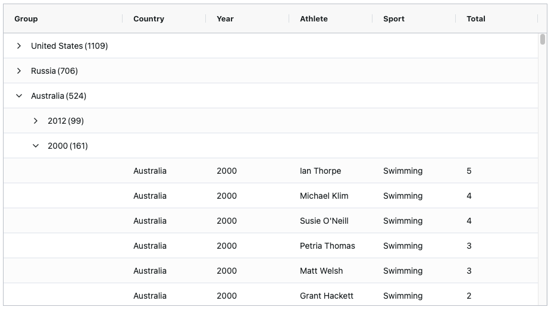
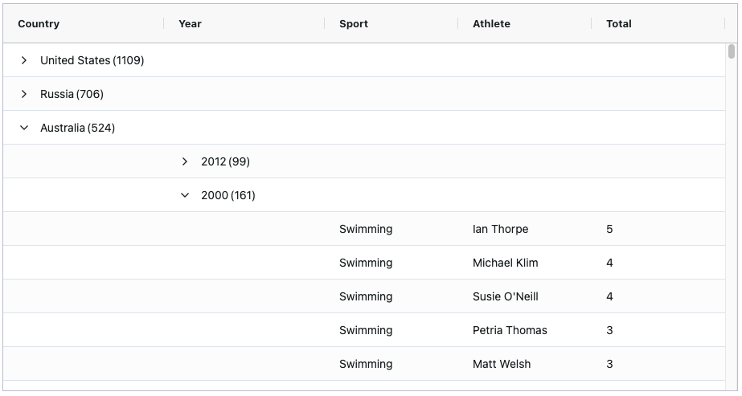

This section compares the different ways row groups can be displayed in the grid.

## Single Group Column 

Row groups are displayed under a single group column. 

As illustrated above, there is a single group column containing the `country` and `year` row groups in a single group hierarchy. 

See the [Single Group Column](../grouping-single-group-column/) section for more details.

## Multiple Group Columns
Separate group columns are used for each row group.

 

As illustrated above, the `country` and `year` row groups are displayed under separate group columns.

See the [Multiple Group Columns](../grouping-single-group-column/) section for more details.

## Group Rows

Row groups are displayed using group rows instead of columns.

 

As illustrated above, the `country` and `year` row groups are displayed using group rows.

See the [Group Rows](../grouping-full-width-group/) section for more details.

## Custom Groups

In some rare cases it may be desirable to supply your own custom groups rather than using the provided display types above. 

See the [Custom Groups](../grouping-custom/) section for more details.

## Next Up

Continue to the next section to learn about: [Single Group Column](../grouping-single-group-column/).
