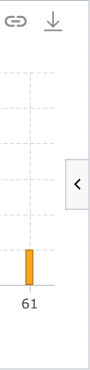
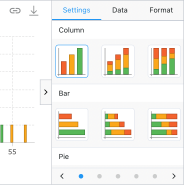
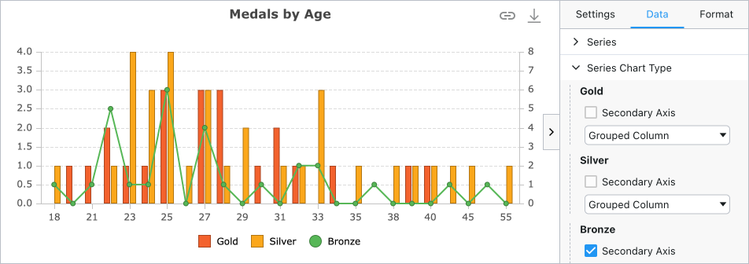
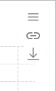

The Chart Tool Panels provide an interactive way to configure the chart. They are available for all chart types and allow an easy way to make changes to the chart data, format and settings.

To open and close the panels, there is Chart Tool Panels Button on the middle right side of the chart (or left side if [Right to Left is enabled](/rtl/)). To open and close the panels programatically using the Grid API, see [Open / Close Chart Tool Panel](/integrated-charts-api-chart-tool-panel/).

    <figure style="flex: 2; margin: 0;">
        
        <figcaption style="text-align: center; font-size: 0.85rem; margin-top: 10px;">Closed Chart Tool Panels</figcaption>
    </figure>
    <figure style="flex: 3; margin: 0;">
        
        <figcaption style="text-align: center; font-size: 0.85rem; margin-top: 10px;">Open Chart Tool Panels</figcaption>
    </figure>

## Chart Panels

The 3 panels for chart configuration are:

- [**Settings Panel**](#settings-panel) - allows changing the chart type and theme.
- [**Data Panel**](#data-panel) - allows changing the data categories and series.
- [**Format Panel**](#format-panel) - allows changing the appearance of the chart.

### Settings Panel

<figure style="flex: 3;">
    
    <figcaption style="text-align: center; font-size: 0.85rem; margin-top: 10px;">Chart Settings Panel</figcaption>
</figure>

The Settings Panel can be used to change the chart type and chart theme. The chart type can be changed using the the different chart icons. The chart theme can be changed using the carousel at the bottom, and will customise the look of the chart. The [Format panel](#format-panel) can also be used to change the appearance of the chart from a formatting perspective.

To configure what chart types and groups are shown and their order, see [Customising Settings Panel chart groups](#customising-settings-panel-chart-groups).

### Data Panel

<figure style="flex: 3;">
    
    <figcaption style="text-align: center; font-size: 0.85rem; margin-top: 10px;">Chart Data Panel</figcaption>
</figure>

The Data Panel can be used to change the chart categories using radio buttons, and the chart series using checkboxes.

Grid columns can either be explicitly configured as categories or series for charting (see [Defining Categories and Series](/integrated-charts-range-chart/#defining-categories-and-series)) or inferred by the data selected in the grid.

When the chart type is a [Combination Chart](/combination-series), there is an extra `Series Chart Type` group that is shown. The `Series Chart Type` group can configure the chart type for each axis and whether the axis appears as a secondary axis.

<figure style="flex: 3;">
    
    <figcaption style="text-align: center; font-size: 0.85rem; margin-top: 10px;">Combination Chart with Series Chart Type group</figcaption>
</figure>

To configure whether categories, series and series chart type groups are shown and their order, see [Customising Data Panel groups](#customising-data-panel-groups).

### Format Panel

<figure style="flex: 3;">
    
    <figcaption style="text-align: center; font-size: 0.85rem; margin-top: 10px;">Chart Format Panel</figcaption>
</figure>

The Format Panel can be used to change the appearance of the chart, such as changing the chart title, legend positioning, axis and series formatting, and the navigator. Formatting options are available based on the chart type that is selected eg, axis formatting is not available for pie charts.

To configure which Format Panel groups are shown and their order, see [Customising Format Panel groups](#customising-format-panel-groups).

## Chart Tool Panels Customisation

The Chart Tool Panels can be customised within the `chartToolPanelsDef` grid option.

<api-documentation source='grid-options/properties.json' section='charts' names='["chartToolPanelsDef"]' ></api-documentation>

### Customising Panels

The Chart Tool Panels can be reorganised using the `chartToolPanelsDef.panels` grid option, and a tool panel can be opened when the chart is loaded using the `chartToolPanelsDef.defaultToolPanel` grid option.

[[note]]
| Note that when the `chartToolPanels` grid option is used, the panels returned from `gridOptions.getChartToolbarItems(params)` are ignored. If `chartToolPanelsDef` is defined without `chartToolPanelsDef.panels`, **all panels** will be shown regardless of the results of `getChartToolbarItems`.

The example below shows panels being reorganised with the `format` tool panel open by default:

<grid-example title='Customising chart tool panels' name='customise-panels' type='generated' options='{ "enterprise": true, "modules": ["clientside", "menu", "charts"] }'></grid-example>

### Customising Settings Panel Chart Groups

The list of chart groups shown on the Settings Panel can be customised using the `chartToolPanelsDef.settingsPanel.chartGroupsDef` grid option. The full list of chart groups are as follows:

<snippet>
const gridOptions = {
    chartToolPanelsDef: {
        settingsPanel: {
            chartGroupsDef: {
                columnGroup: [
                    'column',
                    'stackedColumn',
                    'normalizedColumn'
                ],
                barGroup: [
                    'bar',
                    'stackedBar',
                    'normalizedBar'
                ],
                pieGroup: [
                    'pie',
                    'doughnut'
                ],
                lineGroup: [
                    'line'
                ],
                scatterGroup: [
                    'scatter',
                    'bubble'
                ],
                areaGroup: [
                    'area',
                    'stackedArea',
                    'normalizedArea'
                ],
                histogramGroup: [
                    'histogram'
                ],
                combinationGroup: [
                    'columnLineCombo',
                    'areaColumnCombo',
                    'customCombo'
                ]
            }
        }
    }
}
</snippet>

The example below shows a reordering of chart groups with some chart groups and types removed:

* Pie group appears first
* Columns group appears second with the chart types reordered
* Bar appears last with only a single bar chart type

<grid-example title='Customising settings panel chart groups' name='customise-chart-groups' type='generated' options='{ "enterprise": true, "modules": ["clientside", "menu", "charts"] }'></grid-example>

### Customising Data Panel Groups

The groups shown on the Data Panel can be customised using the `chartToolPanelsDef.dataPanel.groups` grid option. The list specified also indicates the order the groups are shown and whether they are open by default. If `chartToolPanelsDef.dataPanel.groups` is not specified, all groups are shown and are open by default.

The default list and order of data groups are as follows:

<snippet>
const gridOptions = {
    chartToolPanelsDef: {
        dataPanel: {
            groups: [
                { type: 'categories', isOpen: true },
                { type: 'series', isOpen: true },
                { type: 'seriesChartType', isOpen: true }
            ]
        }
    }
}
</snippet>

[[note]]
| The `seriesChartType` group is only shown for [Combination Charts](/charts-combination-series/).

The following example shows the data panel with:

* `series` group closed by default
* `categories` not shown
* `seriesChartType` group shown above `series` and open by default, but only shown if a combination chart is chosen in the settings panel

<grid-example title='Customising data panel groups' name='customise-data-groups' type='generated' options='{ "enterprise": true, "modules": ["clientside", "menu", "charts"] }'></grid-example>

### Customising Format Panel Groups

The groups shown on the Format Panel can be customised using the `chartToolPanelsDef.formatPanel.groups` grid option. The list specified also indicates the order the groups are shown and whether they are open by default. If `chartToolPanelsDef.formatPanel.groups` is not specified, all groups are shown and are closed by default.

[[note]]
| Different chart types will display different format panel groups and will override the groups specified in the grid option if needed. For example, a pie chart does not have an axis or a navigator, so if pie chart is selected, the **Axis** and **Navigator** format panel groups will not be shown even if they are listed in `chartToolPanelsDef.formatPanel.groups`.

The default list and order of format groups are as follows:

<snippet>
const gridOptions = {
    chartToolPanelsDef: {
        formatPanel: {
            groups: [
                {
                    type: 'chart'
                    // If `isOpen` is not specified, group is closed by default
                    // isOpen: false
                },
                { type: 'legend', isOpen: false },
                { type: 'axis', isOpen: false },
                { type: 'series', isOpen: false },
                { type: 'navigator', isOpen: false }
            ]
        }
    }
}
</snippet>

The following example shows the format panel with:

* `chart` group open by default
* `series`, `legend` and `axis` groups shown afterwards, closed by default
* `navigator` not shown

<grid-example title='Customising format panel groups' name='customise-format-groups' type='generated' options='{ "enterprise": true, "modules": ["clientside", "menu", "charts"] }'></grid-example>

## Showing Legacy Chart Toolbar

Since v29 of AG Grid, the Chart Tool Panels Button is the default way to open the Chart Tool Panels. To use the legacy 'hamburger' menu option from the Chart Toolbar, set the grid option `suppressChartToolPanelsButton=true`.

<figure style="flex: 3;">
    
    <figcaption style="text-align: center; font-size: 0.85rem; margin-top: 10px;">Legacy Chart Toolbar 'hamburger' menu option</figcaption>
</figure>

[[note]]
| This will also change how [panels](#customising-panels) are configured, and revert to `gridOptions.getChartToolbarItems(params)` being used to define what is shown.
