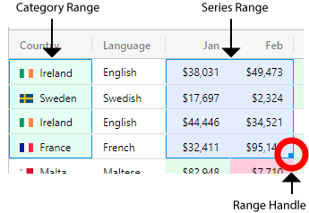
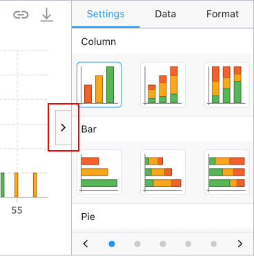
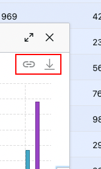

User created charts are designed to provide an out-of-the box charting experience, similar to that found in spreadsheet 
applications such as Excel, but fully integrated inside your applications.

Users can select a range of cells in the grid and create a chart from the context menu, as shown below:

<gif src="chart-showcase.gif" alt="Chart Showcase"></gif>

Notice that Chart Ranges appear in the grid after a chart is created. These provide useful visual feedback for users by
highlighting the charted category and series data in the grid.

Try it out on our [demo page](../../example) by doing the following:

- Select a [Cell Range](/range-selection/) of numeric values in the grid by dragging the mouse over a range of cells.
- Bring up the [Context Menu](/context-menu/) and select the desired chart type from the 'Chart Range' sub menu.

Note that developers can also programmatically create range charts, see [Application Created Charts](/integrated-charts-application-created/).

## Enabling User Created Charts

All that is required for users to create charts, from the data already contained in the grid, is to enable the following grid option:

<snippet>
const gridOptions = {
    enableCharts: true
}
</snippet>

To allow users to create charts from a [Range Selection](/range-selection/) and / or display the [Chart Ranges](/integrated-charts-range-chart/#creating-chart-ranges)
in the grid, `enableRangeSelection` should also be enabled as follows:

<snippet>
const gridOptions = {
    enableCharts: true,
    enableRangeSelection: true
}
</snippet>

## User Created Charts

The animation above highlights a number of charting features. For more details on each feature follow the links provided below:

    

        <ul class="content">
            <li><a href="../integrated-charts-range-chart/#creating-chart-ranges">Chart Ranges</a>: When a chart is created, corresponding chart ranges appear in the grid and can be adjusted via the chart range handle.</li>
            <li><a href="../integrated-charts-range-chart/#category-and-series-ranges">Categories and Series</a>: Columns can be configured as either categories or series for charting. If not configured then the grid will infer whether a column contains category or series data.</li>
        </ul>
    

    

        
    

    

        
    

    

        <ul class="content">
            <li><a href="../integrated-charts-chart-tool-panels/">Chart Tool Panels</a>:
                The chart tool panels can be opened by a button located in the middle right part of the chart. The Chart Tool Panels allow a user to:
                <ul class="content">
                    <li>Change the chart type</li>
                    <li>Change the theme</li>
                    <li>Change which columns are used as categories and series</li>
                    <li>Format different aspects of the chart</li>
                </ul>
            </li>
        </ul>
    

    

        <ul class="content">
            <li><a href="../integrated-charts-toolbar/">Chart Toolbar</a>:
                The chart toolbar is located in the top right area of the chart and allows a user to:
                <ul class="content">
                    <li>Unlink the chart from the grid</li>
                    <li>Download the chart</li>
                </ul>
            </li>
        </ul>
    

    

        
    

By default, user created charts are displayed inside the grid's own popup windows. The windows can be moved (by mouse dragging a window's title bar) and resized (by mouse dragging a window's borders).

It is also possible to display user created charts in a location or application dialog. For more details see the section on [providing a chart container](/integrated-charts-container/).

[[note]]
| If using the grid's own popup window, you will probably want to use the grid option `popupParent` so that the popup windows are not constrained to the bounds of the grid. Typically, users set `popupParent=document.body` to achieve this.

## Next Up

Continue to the next section to learn about the: [Range Chart](/integrated-charts-range-chart/).
