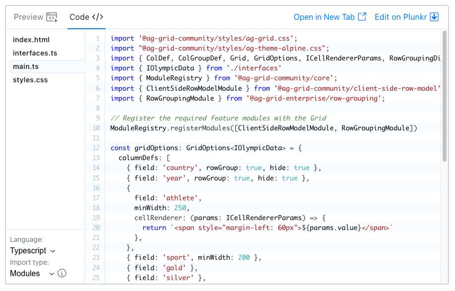

AG Grid modules allow you to cherry pick grid features resulting in a smaller application bundle size overall.

## Modules

The table below summarises the modules provided in AG Grid Community and AG Grid Enterprise. See [Module Examples](/modules/#module-examples) to learn how the Example Runner can be used to determine the module required for a given feature.

<matrix-table src='modules/modules.json' columns='{ "title": "", "module": "Community Module", "exported": "Exported" }' stringonly="true" showcondition="notIn(enterprise, framework)"></matrix-table>

<framework-specific-section frameworks="angular">
<matrix-table src='modules/modules.json' columns='{ "title": "", "module": "Framework Module", "exported": "Exported" }' stringonly="true" showcondition="in(angular)"></matrix-table>
</framework-specific-section>

<framework-specific-section frameworks="react">
<matrix-table src='modules/modules.json' columns='{ "title": "", "module": "Framework Module", "exported": "Exported" }' stringonly="true" showcondition="in(react)"></matrix-table>
</framework-specific-section>

<framework-specific-section frameworks="vue">
<matrix-table src='modules/modules.json' columns='{ "title": "", "module": "Framework Module", "exported": "Exported" }' stringonly="true" showcondition="in(vue)"></matrix-table>
</framework-specific-section>

<matrix-table src='modules/modules.json' columns='{ "title": "", "module": "Enterprise Module<enterprise-icon></enterprise-icon>", "exported": "Exported" }' stringonly="true" showcondition="in(enterprise)"></matrix-table>

## Mixing **packages** and **modules**

<warning>
| Do **not** mix `packages` and `modules`! This will result in a large bundle size!
</warning>

It is important that you do not mix packages and modules in the same application as this will result in AG Grid being included twice 
and doubling your bundle size! All modules are scoped by either `@ag-grid-community/*` or `@ag-grid-enterprise/*` and should not 
be mixed with the standalone packages of `ag-grid-community` and `ag-grid-enterprise`.

| Modules                     | Packages             |
| --------------------------- | -------------------- |
| `@ag-grid-community/xxxxx`  | `ag-grid-community`  |
| `@ag-grid-enterprise/xxxxx` | `ag-grid-enterprise` |

<snippet transform={false}> 
"dependencies": {
    "ag-grid-community": "~@AG_GRID_VERSION@" <- a package dependency
    "@ag-grid-enterprise/row-grouping": "~@AG_GRID_VERSION@"  <- a module dependency
    //...other dependencies...
}
</snippet>

## Installing AG Grid Modules

The grid requires at least one of the following [Row Model](/row-models/) modules:

 - `ClientSideRowModelModule`
 - `InfiniteRowModelModule`
 - `ServerSideRowModelModule` <enterprise-icon></enterprise-icon> 
 - `ViewportRowModelModule` <enterprise-icon></enterprise-icon> 

After that all other modules are optional depending on your requirements.

### Dependent Modules

As a developer you do not need to worry about module dependencies. For example, the `FilterToolPanelModule` depends on the
`SideBarModule` but as we have set up the dependencies as part of the module definition npm will install the dependent packages
for you. Also, when [Registering Modules](/modules/#registering-ag-grid-modules) you only need to register the feature you require
and AG Grid will take care of registering any dependant modules.

## Registering AG Grid Modules

When including AG Grid in your application via modules it is your responsibility to register the required modules with the grid before it is instantiated. You can either register them globally or pass them individually to each grid instance.

### Providing Modules Globally

You can import and register modules to the Grid globally, but you need to ensure that this is done before **_any_** Grids are instantiated.

- Specify Modules Dependencies
- Import Modules
- Register Modules

A real-world example might be that we wish to use the `Client Side Row Model` (the default row model) together with the `CSV`, `Excel` and `Master/Detail` features. 

<framework-specific-section frameworks="angular">
| Additionally we're writing an Angular application, so we need to specify the `@ag-grid-community/angular` dependency:
</framework-specific-section>

<framework-specific-section frameworks="react">
| Additionally we're writing a React application, so we need to specify the `@ag-grid-community/react` dependency:
</framework-specific-section>

<framework-specific-section frameworks="vue">
| Additionally we're writing a Vue application, so we need to specify the `@ag-grid-community/vue` dependency:
</framework-specific-section>

<framework-specific-section frameworks="javascript">
<snippet transform={false}>
|"dependencies": {
|    "@ag-grid-community/client-side-row-model": "~@AG_GRID_VERSION@",
|    "@ag-grid-community/csv-export": "~@AG_GRID_VERSION@",
|    "@ag-grid-enterprise/excel-export": "~@AG_GRID_VERSION@",
|    "@ag-grid-enterprise/master-detail": "~@AG_GRID_VERSION@",
|    //...other dependencies...
|}
</snippet>  
</framework-specific-section>

<framework-specific-section frameworks="angular">
<snippet transform={false}>
|"dependencies": {
|    "@ag-grid-community/client-side-row-model": "~@AG_GRID_VERSION@",
|    "@ag-grid-community/csv-export": "~@AG_GRID_VERSION@",
|    "@ag-grid-enterprise/excel-export": "~@AG_GRID_VERSION@",
|    "@ag-grid-enterprise/master-detail": "~@AG_GRID_VERSION@",
|    "@ag-grid-community/angular": "~@AG_GRID_VERSION@",
|    //...other dependencies...
|}
</snippet>  
</framework-specific-section>

<framework-specific-section frameworks="react">
<snippet transform={false}>
|"dependencies": {
|    "@ag-grid-community/client-side-row-model": "~@AG_GRID_VERSION@",
|    "@ag-grid-community/csv-export": "~@AG_GRID_VERSION@",
|    "@ag-grid-enterprise/excel-export": "~@AG_GRID_VERSION@",
|    "@ag-grid-enterprise/master-detail": "~@AG_GRID_VERSION@",
|    "@ag-grid-community/react": "~@AG_GRID_VERSION@",
|    //...other dependencies...
|}
</snippet>  
</framework-specific-section>

<framework-specific-section frameworks="vue">
<snippet transform={false}>
|"dependencies": {
|    "@ag-grid-community/client-side-row-model": "~@AG_GRID_VERSION@",
|    "@ag-grid-community/csv-export": "~@AG_GRID_VERSION@",
|    "@ag-grid-enterprise/excel-export": "~@AG_GRID_VERSION@",
|    "@ag-grid-enterprise/master-detail": "~@AG_GRID_VERSION@",
|    "@ag-grid-community/vue": "~@AG_GRID_VERSION@",
|    //...other dependencies...
|}
</snippet>
</framework-specific-section>

<framework-specific-section frameworks="javascript">
| We now need to register the Grid modules we wish to use via the `ModuleRegistry`.
</framework-specific-section>

<framework-specific-section frameworks="angular">
| We now need to register the Grid modules we wish to use - note that this does not include `@ag-grid-community/angular` as the Angular support is not a Grid feature, but rather a support library:
</framework-specific-section>

<framework-specific-section frameworks="react">
| We now need to register the Grid modules we wish to use - note that this does not include `@ag-grid-community/react` as the React support is not a Grid feature, but rather a support library:
</framework-specific-section>

<framework-specific-section frameworks="vue">
| We now need to register the Grid modules we wish to use - note that this does not include `@ag-grid-community/vue` as the Vue support is not a Grid feature, but rather a support library:
</framework-specific-section>

<snippet transform={false}>
|import { ModuleRegistry } from '@ag-grid-community/core';     // @ag-grid-community/core will always be implicitly available
|import { ClientSideRowModelModule } from "@ag-grid-community/client-side-row-model";
|import { CsvExportModule } from "@ag-grid-community/csv-export";
|import { ExcelExportModule } from "@ag-grid-enterprise/excel-export";
|import { MasterDetailModule } from "@ag-grid-enterprise/master-detail";
|
|ModuleRegistry.registerModules([
|    ClientSideRowModelModule,
|    CsvExportModule,
|    ExcelExportModule,
|    MasterDetailModule
|]);
|
|// you can optionally register individual modules
|// ModuleRegistry.register(ClientSideRowModelModule);
|// ModuleRegistry.register(CsvExportModule);
|// etc
</snippet>

### Providing Modules To Individual Grids

The steps required are:

- Specify Modules Dependencies
- Import Modules
- Pass to Grid

Using the same real-world example from above the `package.json` dependencies will be the same but how we register the modules is different.

<framework-specific-section frameworks="javascript">
| We pass the modules to the new grid via the `modules` property of the GridOptions parameter.
</framework-specific-section>

<framework-specific-section frameworks="javascript">
<snippet transform={false}>
| import { ClientSideRowModelModule } from "@ag-grid-community/client-side-row-model";
| import { CsvExportModule } from "@ag-grid-community/csv-export";
| import { ExcelExportModule } from "@ag-grid-enterprise/excel-export";
| import { MasterDetailModule } from "@ag-grid-enterprise/master-detail"; 
|
| new Grid(&lt;dom element>, gridOptions, { modules: [ClientSideRowModelModule, CsvExportModule, ExcelExportModule, MasterDetailModule]});
</snippet>  
</framework-specific-section>

<framework-specific-section frameworks="angular">
| Example
</framework-specific-section>

<framework-specific-section frameworks="angular">
<snippet transform={false}>
| import { Component } from '@angular/core';
| import { ClientSideRowModelModule } from "@ag-grid-community/client-side-row-model";
| import { CsvExportModule } from "@ag-grid-community/csv-export";
| import { ExcelExportModule } from "@ag-grid-enterprise/excel-export";
| import { MasterDetailModule } from "@ag-grid-enterprise/master-detail"; 
|
| public modules: Module[] = [ClientSideRowModelModule, CsvExportModule, ExcelExportModule, MasterDetailModule];
|
| &lt;g-grid-angular>
|     [rowData]="rowData"
|     [columnDefs]="columnDefs"
|     [modules]="modules"
| </ag-grid-angular>
</snippet>
</framework-specific-section>

<framework-specific-section frameworks="react">
| We pass the modules to the `modules` prop:
</framework-specific-section>

<framework-specific-section frameworks="react">
<snippet transform={false}>
| import React, { Component } from 'react';
| import { createRoot } from 'react-dom/client';
| import { AgGridReact } from '@ag-grid-community/react';
| import { ClientSideRowModelModule } from "@ag-grid-community/client-side-row-model";
| import { CsvExportModule } from "@ag-grid-community/csv-export";
| import { ExcelExportModule } from "@ag-grid-enterprise/excel-export";
| import { MasterDetailModule } from "@ag-grid-enterprise/master-detail";
| 
| export default class GridExample extends Component {
|     // ...rest of class..
| 
|     render() {
|         return (
|             &lt;div style=&lt;span>{&lt;/span>{height: 400, width: 900}} className="ag-theme-alpine">
|                 &lt;AgGridReact
|                     // properties
|                     columnDefs={this.state.columnDefs}
|                     rowData={this.props.rowData}
|                     modules={[ClientSideRowModelModule, CsvExportModule, ExcelExportModule, MasterDetailModule]}
| 
|                     // events
|                     onGridReady={this.onGridReady}>
|                 &lt;/AgGridReact>
|             &lt;/div>
|         )
|     }
| };
</snippet>
</framework-specific-section>

<framework-specific-section frameworks="vue">
<snippet transform={false}>
| import { createApp } from 'vue';
| import { AgGridVue } from '@ag-grid-community/vue3';
| import { ClientSideRowModelModule } from "@ag-grid-community/client-side-row-model";
| import { CsvExportModule } from "@ag-grid-community/csv-export";
| import { ExcelExportModule } from "@ag-grid-enterprise/excel-export";
| import { MasterDetailModule } from "@ag-grid-enterprise/master-detail";
|
| data() {
|     return {
|         columnDefs: ...column defs...,
|         rowData: ....row data...,
|         modules: [ClientSideRowModelModule, CsvExportModule, ExcelExportModule, MasterDetailModule]
|     }
| }
| &lt;ag-grid-vue
|     :columnDefs="columnDefs"
|     :rowData="rowData"
|     :modules="modules">
| &lt;/ag-grid-vue>
</snippet>
</framework-specific-section>   

<note>
It's important to note that when a module is added via the `modules` property, this module will be available to all other instances of the Grid created afterwards. This will produce the same behaviour as registering modules globally by calling `ModuleRegistry.registerModules()`.
This means that you can't limit the functionality of specific grid instances based on whether you've registered a particular module for that specific grid. If a module was already registered by any one AG Grid instance, it is available to all AG Grid instances created subsequently.
To control features per grid use the relevant [Grid Property](../grid-options/).
</note>

## Core Modules

If you specify _any_ Community or Enterprise dependency then the corresponding `core` module will also be pulled in and be made available to you. For example, if you include `@ag-grid-community/client-side-row-model` - a Community Module - then `@ag-grid-community/core` will be available. If you include `@ag-grid-enterprise/excel-export` - an Enterprise Module - then `@ag-grid-enterprise/core` will also be available.

You'll require the `@ag-grid-community/core` module for Grid related definitions  and `@ag-grid-enterprise/core` for the `LicenseManager`.

If we have the following modules specified:

<snippet transform={false}>
|"dependencies": {
|    "@ag-grid-community/client-side-row-model": "~@AG_GRID_VERSION@",
|    "@ag-grid-enterprise/excel-export": "~@AG_GRID_VERSION@",
|    //...other dependencies...
|}
</snippet>

We can then assume the `core` packages are available implicitly and import from them:

<snippet transform={false}>
|import { ColumnApi, GridApi } from "@ag-grid-community/core";
|import { LicenseManager } from "@ag-grid-enterprise/core";
|
|LicenseManager.setLicenseKey(...your key...);
</snippet>

## CSS/SCSS Paths

CSS & SCSS is available in the `@ag-grid-community/styles` module.

<snippet transform={false} language="css">
|/* CSS Community */
|import "@ag-grid-community/styles/ag-grid.css";
|import "@ag-grid-community/styles/ag-theme-alpine.css";
</snippet>

If using SCSS the theme defaults to `alpine`, so you don't have to explicitly include it.

<snippet transform={false} language="scss">
|// SCSS Community
|@use "~@ag-grid-community/styles" as ag;
|
|// Choose balham over default alpine
|@include ag.grid-styles((
|    theme: balham
|));
</snippet>

See [Choosing a Theme](/global-style-customisation-sass/#choosing-a-theme) for full details of how to select a theme.

## Module Examples

Our Example Runner enables you to view the `modules` version of an example via the dropdown in the top right-hand corner. 

When 'Modules' is selected, the source code includes the required modules along with the module import paths. This means
you can copy and paste code from our examples without further tweaks.

