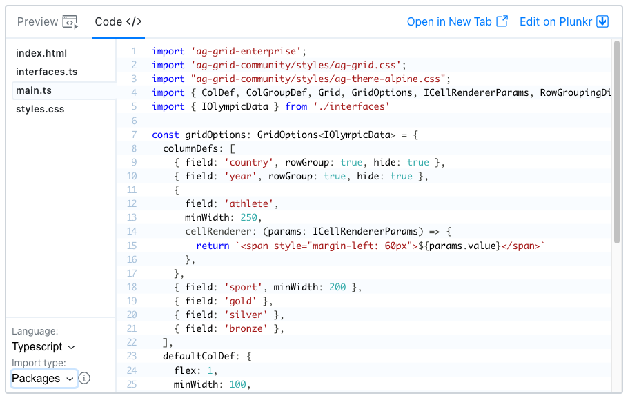

AG Grid `packages` are the easiest way to get started with AG Grid, but the trade-off will be a larger overall bundle size if you don't need all of the features within a given package.

## Introduction

The following artifacts are "`packages`" and are designed to work together:

[[only-javascript]]
|| Package Name | Contents |
|| ------------ | -------- |
|| `ag-grid-community` | All Community Features |
|| `ag-grid-enterprise` | All Enterprise Features |
[[only-angular]]
|| Package Name | Contents |
|| ------------ | -------- |
|| `ag-grid-community` | All Community Features |
|| `ag-grid-enterprise` | All Enterprise Features |
|| `ag-grid-angular` | Angular Support |
[[only-react]]
|| Package Name | Contents |
|| ------------ | -------- |
|| `ag-grid-community` | All Community Features |
|| `ag-grid-enterprise` | All Enterprise Features |
|| `ag-grid-react` | React Support |
[[only-vue]]
|| Package Name | Contents |
|| ------------ | -------- |
|| `ag-grid-community` | All Community Features |
|| `ag-grid-enterprise` | All Enterprise Features |
|| `ag-grid-vue` | Vue Support |


When using `packages` you get all of the code within that package and cannot pick and choose which features you require. Unlike [modules](/modules/) there is no need to register feature modules with the grid as the packages take care of this for you.

As a result it is easier to use `packages` but the trade-off will be that you end up with a larger bundle size if you don't require all the features within a given package.

If you do decide to use `packages` you'll need to specify `ag-grid-community` as a minimum dependency:

```js
"dependencies": {
    "ag-grid-community": "~@AG_GRID_VERSION@"
    //...other dependencies...
}
```

You can then (optionally) specify `ag-grid-enterprise` if you require Enterprise features:

```diff
"dependencies": {
    "ag-grid-community": "~@AG_GRID_VERSION@"
+   "ag-grid-enterprise": "~@AG_GRID_VERSION@"
    //...other dependencies...
}
```

If you do require Enterprise features you'll additionally need to import the `ag-grid-enterprise` package for it to be included in your application:

```js
import 'ag-grid-enterprise';
```

[[only-angular]]
|Finally, if you're using Angular you'll need to specify `ag-grid-angular` packages:
|
|```diff
|"dependencies": {
|    "ag-grid-community": "~@AG_GRID_VERSION@"
|    "ag-grid-enterprise": "~@AG_GRID_VERSION@"
|+   "ag-grid-angular": "~@AG_GRID_VERSION@"
|    //...other dependencies...
|}
|```
[[only-react]]
|Finally, if you're using Reaxt you'll need to specify `ag-grid-react` packages:
|
|```diff
|"dependencies": {
|    "ag-grid-community": "~@AG_GRID_VERSION@"
|    "ag-grid-enterprise": "~@AG_GRID_VERSION@"
|+   "ag-grid-react": "~@AG_GRID_VERSION@"
|    //...other dependencies...
|}
|```
[[only-vue]]
|Finally, if you're using Vue you'll need to specify `ag-grid-vue` packages:
|
|```diff
|"dependencies": {
|    "ag-grid-community": "~@AG_GRID_VERSION@"
|    "ag-grid-enterprise": "~@AG_GRID_VERSION@"
|+   "ag-grid-vue": "~@AG_GRID_VERSION@"
|    //...other dependencies...
|}
|```

## Example: Packages

If you are using packages then check that you select the 'Packages' option from the example runner dropdown as this means the code that you see will be using `packages`. This is important as it means any imports will be from `packages` enabling correct copy and pasting.



## Mixing **packages** and **modules**

[[warning]]
| Do **not** mix `packages` and `modules`! This will result in a large bundle size!

It is vitally important that you do not mix packages and modules in the same application as you will end up including AG Grid twice and doubling your bundle size! All modules are scoped by either `@ag-grid-community/*` or `@ag-grid-enterprise/*` and should not be mixed with the standalone packages of `ag-grid-community` and `ag-grid-enterprise`.

 | Packages             | Modules                     |
 | -------------------- | --------------------------- |
 | `ag-grid-community`  | `@ag-grid-community/xxxxx`  |
 | `ag-grid-enterprise` | `@ag-grid-enterprise/xxxxx` |


```js 
"dependencies": {
    "ag-grid-community": "~@AG_GRID_VERSION@" <- a package dependency
    "@ag-grid-enterprise/row-grouping": "~@AG_GRID_VERSION@"  <- a module dependency
    //...other dependencies...
}
```

Please refer to the [modules](/modules/) documentation if you are concerned with bundle size.

Please refer to the [Getting Started](/getting-started/) guides for a walk through on how to install and use these packages from the ground up.

