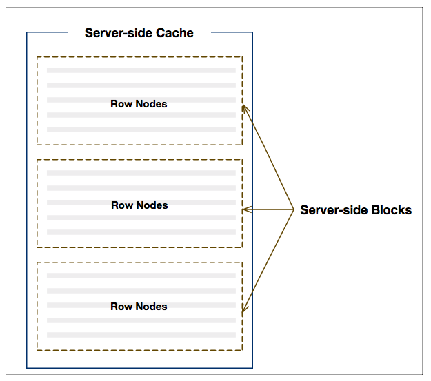

This section covers the Server-Side Cache and configurations available in the Server-Side Row Model.

As many of the configurations available in the Server-Side Row Model relate to the Server-Side Cache it is important to
understand how the grid organises data obtained from the server into caches.

## Server-Side Cache

The grid arranges rows into blocks which are in turn stored in a cache as illustrated below:

    
    
Fig 1. Server-side Cache

There is a cache containing the top-level rows (i.e. on the root node) and for each individual [Row Grouping](/server-side-model-grouping/)
level. When the grid initialises, it will retrieve an initial number (as per configuration) of blocks containing rows,
and as the user scrolls down more blocks will be loaded.

Several [Configurations](/server-side-model-api-reference/), such as `cacheBlockSize` and `maxBlocksInCache`, are expressed in terms of the Server-Side Cache.

The example below demonstrates some configurations. Note the following:

- The grid property `cacheBlockSize = 50`. This sets the block size to 50, thus rows are read back 50 at a time.
- The grid property `maxBlocksInCache = 2`. This means the grid will keep two blocks in memory only. To see this in action, scroll past row 100 (which will require a third block to be loaded), then quickly scroll back to the start and you will observe the first block needs to be reloaded.

<grid-example title='Cache Configurations' name='cache-configurations' type='generated' options='{ "enterprise": true, "modules": ["serverside"] }'></grid-example>

## Block Loading Debounce

It may be desirable to scroll through the entire dataset without the need for intermediate blocks to be loaded. 

The example below shows how debouncing block loading can be achieved. Note the following:

- The response from the server sets the `rowCount` property so that the vertical scrollbars bounds are set such that the entire dataset can be scrolled through.

- `blockLoadDebounceMillis = 1000` - loading of blocks is delayed by `1000ms`. This allows for skipping over blocks when scrolling to advanced positions.

- The grid property `debug = true`. This means the browser's dev console will show loading block details.

<grid-example title='Block Loading Debounce' name='block-load-debounce' type='generated' options='{ "enterprise": true, "modules": ["serverside", "menu", "columnpanel"] }'></grid-example>

## Initial Scroll Position

When using the server-side row model the initial scroll position of the grid can be set. This is achieved by calling 
`api.ensureIndexVisible()` after setting the data source to the grid. 

[[note]]
| It is important that the `serverSideInitialRowCount` property is set to a value that is greater than the sum of the row index provided to `api.ensureIndexVisible()` and the number of rows displayed in the grid's viewport.

This is demonstrated in the example below, note the following:

- The `serverSideInitialRowCount` property has been set to provide an initial length to the vertical scrollbars.

- After the datasource has been set `api.ensureIndexVisible(5000, 'top')` is called, causing the grid to scroll down to row `5000`.

<grid-example title='Initial Scroll Position' name='initial-scroll-position' type='generated' options='{ "enterprise": true, "modules": ["serverside", "menu", "columnpanel"] }'></grid-example>

## Next Up

Continue to the next section to learn about [SSRM Sorting](/server-side-model-sorting/).
