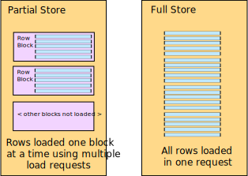

Inside the Server-Side Row Model (SSRM), rows are stored in Row Stores. There are two types of Row Stores: 1) Infinite Store and 2) Full Store. This section explains more on these two different Row Store types.

## Row Stores

A Row Store stores [Row Nodes](../row-object/). A Row Node represents one Row inside the grid.

There is at least one Row Store inside the grid for storing top level rows. The diagram below shows a SSRM with one Row Store.

    
    
Fig 1. Node Store

If the grid had [Row Grouping](../server-side-model-grouping/) there would be many rows stores, but for now we consider the simple case.

## Row Store Types

There are two types of Row Stores, which differ in their strategy for loading and managing rows. The types of Row Stores are as follows:

- **Partial Store**:
    Loads rows in blocks (eg 100 rows in a block, thus loading 100 rows at a time). 
    Blocks are loaded as the user scrolls down and stored in a cache inside the 
    Partial Store. This technique, of loading rows as the user scrolls down,
    is known as [Infinite Scrolling](https://en.wiktionary.org/wiki/infinite_scroll). 
    Blocks that are no longer needed (the user has scrolled past the blocks rows and are no longer visible) 
    are optionally purged from the cache, thus controlling the browser's memory footprint.
        
    The name "Partial Store" comes from the fact rows are partially loaded using blocks, 
    one block at at time.

- **Full Store**:
    Loads rows all at once (eg if 500 children when you expand a group, it loads
    all 500 child rows). This allows sorting and filtering inside the grid (a server
    request isn't required to sort and filter) and also provides the option of
    inserting and removing rows (explained in the section on 
    [Transactions](../server-side-model-transactions/)).

    The name "Full Store" comes from the fact all data is loaded into the store,
    and not partially using blocks. The store is full of rows, no more rows will be loaded
    after the initial load.

    
    
Fig 2. Partial Store vs Full Store

Set the store type using the grid property `serverSideStoreType`. Set to `full` to use the Full Store and `partial` to use the Partial Store. If not set, the Partial Store is used.

Below shows a simple example using Partial Store. Note the following:

- Open the console to observe when the server is called to load rows.
- Rows are loaded back 100 rows at a time. As the user scrolls down, more rows will be loaded.
- Sorting the data is not possible by the grid. Sorting on the server side is explained in [Server-Side Sorting](../server-side-model-sorting/).

<grid-example title='Partial Store' name='partial-store' type='generated' options='{ "enterprise": true, "modules": ["serverside"] }'></grid-example>

Below shows a simple example using Full Store. Note the following:

- Open the console to observe when the server is called to load rows.
- All the rows are loaded back in one go.
- Sorting the data is done by the grid when the columns headers are clicked. Sorting is possible by the grid because the entire dataset is loaded into the grid.

<grid-example title='Full Store' name='full-store' type='generated' options='{ "enterprise": true, "modules": ["serverside"] }'></grid-example>

[[note]]
| At this point you might be wondering the advantage of the Full store with just using
| the standard [Client-Side Row Model](../client-side-model/).
| The difference is when Row Grouping, the children of the row groups are loaded as the
| groups are expanded. For Client-Side Row Model, all data needs to be loaded up front.

## Partial Store vs Full Store

So when is it best to use Partial Store? And when is it best to use Full Store?

Use Full Store when all of the data comfortable fit's inside the browsers memory. It is possible to present big data inside an application using a combination of Full Store and Row Grouping. For example a dataset could have 10 million rows, however due to grouping only 200 rows are brought back at any group level - in this case Full Store would work fine.

Use Partial Store when all of the data at a particular group level will not comfortably fit inside the browsers memory. For example a dataset with 10 million rows with no grouping applied would not fit inside a browsers memory, thus Partial Store would be needed to view it.

## Partial Store Restrictions

The Partial Store comes with one advantage - it can manage an very large (partial?) amount of data. However it comes with the following restrictions.

- ### In Grid Sorting
    Because data is read back in blocks from the Partial Store, the grid cannot sort the data,
    as it does not have all the data loaded.

- ### In Grid Filtering
    Because data is read back in blocks from the Partial Store, the grid cannot filter the data,
    as it does not have all the data loaded.

- ### Live Data
    If data is live with regards inserts and deletes, this will cause problems with the
    Partial Store. This is because data is read back from the server in blocks.
    If the data is changing such that the data in each block changes,
    then the Partial Store will get incorrect rows. For example consider the following scenario:

    1. The grid asks for rows 0 to 99 (i.e. first block of 100 rows) and these get read from a database.
    1. Another application inserts a row at index 50.
    1. The grid asks for rows 100 to 199 (the second block of 100 rows) and again these get read from the database.

    In this scenario the grid will have the last row in the first block appear again as the first row in the second
    block. This is because the row was at index 99 before the insert and then at index 100 after the insert.

    If data is changing such that row indexes will change and result in duplicate or missing rows across
    blocks, then it is best either avoid the Partial Store or use a snapshot of data to prevent data updates.

## Next Up

Continue to the next section to learn about [Configuration](../server-side-model-configuration/) of the SSRM.

