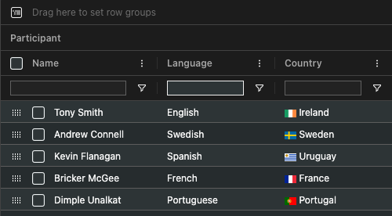

# Angular Data Grid | Angular Table

<div align="center">
    <picture>
      <source media="(prefers-color-scheme: dark)" srcset="https://github.com/ag-grid/ag-grid/blob/latest/documentation/ag-grid-docs/public/images/ag-logos/svg-logos/AG-Grid-Logo_Dark-Theme.svg?raw=true"/>
      <source media="(prefers-color-scheme: light)" srcset="https://github.com/ag-grid/ag-grid/blob/latest/documentation/ag-grid-docs/public/images/ag-logos/svg-logos/AG-Grid-Logo_Light-Theme.svg?raw=true"/>
      
    </picture>
    <div align="center">
        <h4><a href="https://www.ag-grid.com?utm_source=ag-grid-angular-readme&utm_medium=repository&utm_campaign=github">🌐 Website</a> • <a href="https://www.ag-grid.com/angular-data-grid/getting-started/?utm_source=ag-grid-angular-readme&utm_medium=repository&utm_campaign=github">📖 Documentation</a> • <a href="https://www.ag-grid.com/community?utm_source=ag-grid-angular-readme&utm_medium=repository&utm_campaign=github">🏘️ Community</a></h4>
    </div>
    <br>
    <a href="https://github.com/ag-grid/ag-grid/releases">
        
    </a>
    <a href="https://www.npmjs.com/package/ag-grid-angular">
        
    </a>
    <a href="https://github.com/ag-grid/ag-grid">
        
    </a>
    <a href="https://github.com/ag-grid/ag-grid">
        
    </a>
    <br><br>
    <a href="https://sonarcloud.io/dashboard?id=ag-grid-community">
      
    </a>
    <a href="https://npm.io/package/ag-grid-angular">
        
    </a>
    <a href="https://github.com/ag-grid/ag-grid/graphs/commit-activity">
        
    </a>
    <a href="https://github.com/ag-grid/ag-grid/network/dependents">
        
    </a>
    <br><br>
    <!-- START MAIN DESCRIPTION -->
	<p>AG Grid is a <strong>fully-featured</strong> and <strong>highly customizable</strong> Angular Data Grid. It delivers <strong>outstanding performance</strong> and has <strong>no third-party dependencies</strong>.</p>	
<!-- END MAIN DESCRIPTION -->
    <br>
</div>

<picture>
    <source srcset="../../readme-assets/kitchen-sink-demo-light.gif" media="(prefers-color-scheme: light)">
    <source srcset="../../readme-assets/kitchen-sink-demo-dark.gif" media="(prefers-color-scheme: dark)">
    
</picture>
<div align="right"><span><a href="https://ag-grid.com/example/?utm_source=ag-grid-angular-readme&utm_medium=repository&utm_campaign=github">Live Demo</a></span></div>

## 📖 Overview

<details>
  <summary><strong>Table of Contents</strong></summary>

-   [📖 Overview](#-overview)
    -   [Features](#features)
    -   [Examples](#examples)
-   [⚡️ Quick Start](#️-quick-start)
    -   [Installation](#installation)
    -   [Setup](#setup)
    -   [Seed Projects](#seed-projects)
-   [🛠️ Customisations](#️-customisations)
    -   [Custom Components](#custom-components)
    -   [Themes](#themes)
    -   [Custom Themes](#custom-themes)
-   [🌍 Community](#-community)
    -   [Tools \& Extensions](#tools--extensions)
    -   [Showcase](#showcase)
    -   [Stargazers](#stargazers)
-   [🤝 Support](#-support)
    -   [Enterprise Support](#enterprise-support)
    -   [Bug Reports](#bug-reports)
    -   [Questions](#questions)
    -   [Contributing](#contributing)
-   [⚠️ License](#️-license)

</details>

AG Grid is available in two versions: Community & Enterprise.

-   `ag-grid-community` is free, available under the MIT license, and comes with all of the core features expected from a Angular Data Grid, including [Sorting](https://www.ag-grid.com/angular-data-grid/row-sorting/#sorting?utm_source=ag-grid-angular-readme&utm_medium=repository&utm_campaign=github), [Filtering](https://www.ag-grid.com/angular-data-grid/filtering/?utm_source=ag-grid-angular-readme&utm_medium=repository&utm_campaign=github), [Pagination](https://www.ag-grid.com/angular-data-grid/row-pagination/?utm_source=ag-grid-angular-readme&utm_medium=repository&utm_campaign=github), [Editing](https://www.ag-grid.com/angular-data-grid/cell-editing/?utm_source=ag-grid-angular-readme&utm_medium=repository&utm_campaign=github), [Custom Components](https://www.ag-grid.com/angular-data-grid/component-cell-renderer/?utm_source=ag-grid-angular-readme&utm_medium=repository&utm_campaign=github), [Theming](https://www.ag-grid.com/angular-data-grid/themes/?utm_source=ag-grid-angular-readme&utm_medium=repository&utm_campaign=github) and more.
-   `ag-grid-enterprise` is available under a commercial license and comes with advanced features, like [Integrated Charting](https://www.ag-grid.com/angular-data-grid/integrated-charts/?utm_source=ag-grid-angular-readme&utm_medium=repository&utm_campaign=github), [Row Grouping](https://www.ag-grid.com/angular-data-grid/grouping/?utm_source=ag-grid-angular-readme&utm_medium=repository&utm_campaign=github), [Aggregation](https://www.ag-grid.com/angular-data-grid/grouping/?utm_source=ag-grid-angular-readme&utm_medium=repository&utm_campaign=github), [Pivoting](https://www.ag-grid.com/angular-data-grid/pivoting/?utm_source=ag-grid-angular-readme&utm_medium=repository&utm_campaign=github), [Master/Detail](https://www.ag-grid.com/angular-data-grid/master-detail/?utm_source=ag-grid-angular-readme&utm_medium=repository&utm_campaign=github), [Server-side Row Model](https://www.ag-grid.com/angular-data-grid/server-side-model/?utm_source=ag-grid-angular-readme&utm_medium=repository&utm_campaign=github), and [Exporting](https://www.ag-grid.com/angular-data-grid/excel-export/?utm_source=ag-grid-angular-readme&utm_medium=repository&utm_campaign=github) in addition to dedicated support from our Engineering team.

### Features

| Feature                                                                                                                                                             | AG Grid Community | AG Grid Enterprise |
| ------------------------------------------------------------------------------------------------------------------------------------------------------------------- | ----------------- | ------------------ |
| [Filtering](https://www.ag-grid.com/angular-data-grid/filtering/?utm_source=ag-grid-angular-readme&utm_medium=repository&utm_campaign=github)                       | ✅                | ✅ (Advanced)      |
| [Sorting](https://www.ag-grid.com/angular-data-grid/row-sorting/#sorting?utm_source=ag-grid-angular-readme&utm_medium=repository&utm_campaign=github)               | ✅                | ✅                 |
| [Cell Editing](https://www.ag-grid.com/angular-data-grid/cell-editing/?utm_source=ag-grid-angular-readme&utm_medium=repository&utm_campaign=github)                 | ✅                | ✅                 |
| [CSV Export](https://www.ag-grid.com/angular-data-grid/csv-export/?utm_source=ag-grid-angular-readme&utm_medium=repository&utm_campaign=github)                     | ✅                | ✅                 |
| [Drag & Drop](https://www.ag-grid.com/angular-data-grid/drag-and-drop/?utm_source=ag-grid-angular-readme&utm_medium=repository&utm_campaign=github)                 | ✅                | ✅                 |
| [Themes and Styling](https://www.ag-grid.com/angular-data-grid/themes/?utm_source=ag-grid-angular-readme&utm_medium=repository&utm_campaign=github)                 | ✅                | ✅                 |
| [Selection](https://www.ag-grid.com/angular-data-grid/row-selection/?utm_source=ag-grid-angular-readme&utm_medium=repository&utm_campaign=github)                   | ✅                | ✅                 |
| [Accessibility](https://www.ag-grid.com/angular-data-grid/accessibility/?utm_source=ag-grid-angular-readme&utm_medium=repository&utm_campaign=github)               | ✅                | ✅                 |
| [Infinite Scrolling](https://www.ag-grid.com/angular-data-grid/infinite-scrolling/?utm_source=ag-grid-angular-readme&utm_medium=repository&utm_campaign=github)     | ✅                | ✅                 |
| [Pagination](https://www.ag-grid.com/angular-data-grid/row-pagination/?utm_source=ag-grid-angular-readme&utm_medium=repository&utm_campaign=github)                 | ✅                | ✅                 |
| [Server-Side Data](https://www.ag-grid.com/angular-data-grid/server-side-model/?utm_source=ag-grid-angular-readme&utm_medium=repository&utm_campaign=github)        | ✅                | ✅ (Advanced)      |
| [Custom Components](https://www.ag-grid.com/angular-data-grid/component-cell-renderer/?utm_source=ag-grid-angular-readme&utm_medium=repository&utm_campaign=github) | ✅                | ✅                 |
| [Integrated Charting](https://www.ag-grid.com/angular-data-grid/integrated-charts/?utm_source=ag-grid-angular-readme&utm_medium=repository&utm_campaign=github)     | ❌                | ✅                 |
| [Range Selection](https://www.ag-grid.com/angular-data-grid/range-selection/?utm_source=ag-grid-angular-readme&utm_medium=repository&utm_campaign=github)           | ❌                | ✅                 |
| [Row Grouping and Aggregation](https://www.ag-grid.com/angular-data-grid/grouping/?utm_source=ag-grid-angular-readme&utm_medium=repository&utm_campaign=github)     | ❌                | ✅                 |
| [Pivoting](https://www.ag-grid.com/angular-data-grid/pivoting/?utm_source=ag-grid-angular-readme&utm_medium=repository&utm_campaign=github)                         | ❌                | ✅                 |
| [Excel Export](https://www.ag-grid.com/angular-data-grid/excel-export/?utm_source=ag-grid-angular-readme&utm_medium=repository&utm_campaign=github)                 | ❌                | ✅                 |
| [Clipboard Operations](https://www.ag-grid.com/angular-data-grid/clipboard/?utm_source=ag-grid-angular-readme&utm_medium=repository&utm_campaign=github)            | ❌                | ✅                 |
| [Master/Detail](https://www.ag-grid.com/angular-data-grid/master-detail/?utm_source=ag-grid-angular-readme&utm_medium=repository&utm_campaign=github)               | ❌                | ✅                 |
| [Tree Data](https://www.ag-grid.com/angular-data-grid/tree-data/?utm_source=ag-grid-angular-readme&utm_medium=repository&utm_campaign=github)                       | ❌                | ✅                 |
| [Column Menu](https://www.ag-grid.com/angular-data-grid/column-menu/?utm_source=ag-grid-angular-readme&utm_medium=repository&utm_campaign=github)                   | ❌                | ✅                 |
| [Context Menu](https://www.ag-grid.com/angular-data-grid/context-menu/?utm_source=ag-grid-angular-readme&utm_medium=repository&utm_campaign=github)                 | ❌                | ✅                 |
| [Tool Panels](https://www.ag-grid.com/angular-data-grid/tool-panel/?utm_source=ag-grid-angular-readme&utm_medium=repository&utm_campaign=github)                    | ❌                | ✅                 |
| [Support](https://ag-grid.zendesk.com/hc/en-us)                                                                                                                     | ❌                | ✅                 |

> [!IMPORTANT]
> Visit the [Pricing](https://www.ag-grid.com/license-pricing/?utm_source=ag-grid-angular-readme&utm_medium=repository&utm_campaign=github) page for a full comparison.

### Examples

We've created several demos to showcase AG Grid's rich feature set across different use cases. See them in action below, or interact with them on our [Demo](https://www.ag-grid.com/example/?utm_source=ag-grid-angular-readme&utm_medium=repository&utm_campaign=github) page.

<details open>
  <summary>🏦 <b>Financial Demo</b></summary>
  <br>
  <p>Financial data example featuring live updates and sparklines:</p>
  <a href="https://ag-grid.com/example-finance/?utm_source=ag-grid-angular-readme&utm_medium=repository&utm_campaign=github">
    <picture>
      <source srcset="../../readme-assets/finance-demo-light.gif" media="(prefers-color-scheme: light)">
      <source srcset="../../readme-assets/finance-demo-dark.gif" media="(prefers-color-scheme: dark)">
      
    </picture>
  </a>
  <br>
  <div align="right"><span><a href="https://ag-grid.com/example-finance/?utm_source=ag-grid-angular-readme&utm_medium=repository&utm_campaign=github">Live Demo</a></span>&nbsp;•&nbsp;<span><a href="https://github.com/ag-grid/ag-grid-demos/tree/main/finance">Source Code</a></span></div>
<br>
</details>
<details>
  <summary>📦 <b>Inventory Demo</b></summary>
  <br>
  <p>Inventory data example to view and manage products:</p>
  <a href="https://ag-grid.com/example-inventory/?utm_source=ag-grid-angular-readme&utm_medium=repository&utm_campaign=github">
    <picture>
      <source srcset="../../readme-assets/inventory-demo-light.gif" media="(prefers-color-scheme: light)">
      <source srcset="../../readme-assets/inventory-demo-dark.gif" media="(prefers-color-scheme: dark)">
      
    </picture>
  </a>
  <div align="right"><span><a href="https://ag-grid.com/example-inventory/?utm_source=ag-grid-angular-readme&utm_medium=repository&utm_campaign=github">Live Demo</a></span>&nbsp;•&nbsp;<span><a href="https://github.com/ag-grid/ag-grid-demos/tree/main/inventory">Source Code</a></span></div>
<br>
</details>
<details>
    
  <summary>🧑‍💼 <b>HR Demo</b></summary>
  <br>
  <p>HR data example showing hierarchical employee data:</p>
  <a href="https://ag-grid.com/example-hr/?utm_source=ag-grid-angular-readme&utm_medium=repository&utm_campaign=github">
    <picture>
      <source srcset="../../readme-assets/hr-demo-light.gif" media="(prefers-color-scheme: light)">
      <source srcset="../../readme-assets/hr-demo-dark.gif" media="(prefers-color-scheme: dark)">
      
    </picture>
  </a>
  <div align="right"><span><a href="https://ag-grid.com/example-hr/?utm_source=ag-grid-angular-readme&utm_medium=repository&utm_campaign=github">Live Demo</a></span>&nbsp;•&nbsp;<span><a href="https://github.com/ag-grid/ag-grid-demos/tree/main/hr">Source Code</a></span></div>
<br>
</details>

## ⚡️ Quick Start

<!-- START QUICK START DESCRIPTION -->

AG Grid is easy to set up - all you need to do is provide your data and define your column structure.

<!-- END QUICK START DESCRIPTION -->

### Installation

```sh
$ npm install --save ag-grid-angular
```

### Setup

**1. Provide a Container**

<!-- Create Angular -->

Load the AG Grid library and create a blank container div:

```html
<html lang="en">
    <head>
        <!-- Includes all JS & CSS for the Angular Data Grid -->
        <script src="https://cdn.jsdelivr.net/npm/ag-grid-angular/dist/ag-grid-angular.min.js"></script>
    </head>
    <body>
        <!-- Your Data Grid container -->
        <div id="myGrid"></div>
    </body>
</html>
```

**2. Instantiating the Angular Data Grid**

Create the Data Grid inside of your container div using `createGrid`.

```js
// Grid Options: Contains all of the Data Grid configurations
const gridOptions = {};

// Your Javascript code to create the Data Grid
const myGridElement = document.querySelector('#myGrid');
agGrid.createGrid(myGridElement, gridOptions);
```

**3. Define Rows and Columns**

```js
// Grid Options: Contains all of the Data Grid configurations
const gridOptions = {
    // Row Data: The data to be displayed.
    rowData: [
        { make: 'Tesla', model: 'Model Y', price: 64950, electric: true },
        { make: 'Ford', model: 'F-Series', price: 33850, electric: false },
        { make: 'Toyota', model: 'Corolla', price: 29600, electric: false },
    ],
    // Column Definitions: Defines the columns to be displayed.
    columnDefs: [
        { field: 'make' },
        { field: 'model' },
        { field: 'price' },
        { field: 'electric' },
    ],
};
```

**4. Styling the Angular Data Grid**

Add the `ag-theme-quartz` CSS class to your Data Grid container div to apply the Data Grid's theme.

```html
<!-- Your Data Grid container -->
<div id="myGrid" class="ag-theme-quartz" style="height: 500px"></div>
```

> [!IMPORTANT]
> For more information on building Data Grids with AG Grid, refer to our [Documentation](https://www.ag-grid.com/angular-data-grid/getting-started/?utm_source=ag-grid-angular-readme&utm_medium=repository&utm_campaign=github).

### Seed Projects

We also provide [Seed Projects](https://github.com/ag-grid/ag-grid-seed) to help you get started with common configurations:

<table width="100%">
  <thead>
    <tr>
      <th>Environment</th>
      <th>Framework</th>
      <th>Packages</th>
      <th>Modules</th>
    </tr>
  </thead>
  <tbody>
    <tr>
      <td>Create React App (CRA)</td>
      <td align="middle"></td>
      <td><a href="https://github.com/ag-grid/ag-grid-seed/tree/main/enterprise/packages/create-react-app">Packages</a></td>
      <td><a href="https://github.com/ag-grid/ag-grid-seed/tree/main/enterprise/modules/create-react-app">Modules</a></td>
    </tr>
    <tr>
      <td>Vite</td>
      <td align="middle"></td>
      <td><a href="https://github.com/ag-grid/ag-grid-seed/tree/main/enterprise/packages/vite-react">Packages</a></td>
      <td><a href="https://github.com/ag-grid/ag-grid-seed/tree/main/enterprise/modules/vite-react">Modules</a></td>
    </tr>
    <tr>
      <td>Vite - TypeScript</td>
      <td align="middle"></td>
      <td><a href="https://github.com/ag-grid/ag-grid-seed/tree/main/enterprise/packages/vite-typescript">Packages</a></td>
      <td><a href="https://github.com/ag-grid/ag-grid-seed/tree/main/enterprise/modules/vite-typescript">Modules</a></td>
    </tr>
    <tr>
      <td>Webpack 5 - TypeScript</td>
      <td align="middle"></td>
      <td><a href="https://github.com/ag-grid/ag-grid-seed/tree/main/enterprise/packages/webpack5-typescript">Packages</a></td>
      <td><a href="https://github.com/ag-grid/ag-grid-seed/tree/main/enterprise/modules/webpack5-typescript">Modules</a></td>
    </tr>
    <tr>
      <td>Webpack 5 - Angular</td>
      <td align="middle"></td>
      <td><a href="https://github.com/ag-grid/ag-grid-seed/tree/main/enterprise/packages/webpack5-javascript">Packages</a></td>
      <td><a href="https://github.com/ag-grid/ag-grid-seed/tree/main/enterprise/modules/webpack5-javascript">Modules</a></td>
    </tr>
    <tr>
      <td>Angular CLI</td>
      <td align="middle"></td>
      <td><a href="https://github.com/ag-grid/ag-grid-seed/tree/main/enterprise/packages/angular-cli">Packages</a></td>
      <td><a href="https://github.com/ag-grid/ag-grid-seed/tree/main/enterprise/modules/angular-cli">Modules</a></td>
    </tr>
    <tr>
      <td>Nuxt</td>
      <td align="middle"></td>
      <td><a href="https://github.com/ag-grid/ag-grid-seed/tree/main/enterprise/packages/nuxt-vue3">Packages</a></td>
      <td><a href="https://github.com/ag-grid/ag-grid-seed/tree/main/enterprise/modules/nuxt-vue3">Modules</a></td>
    </tr>
    <tr>
      <td>Vite</td>
      <td align="middle"></td>
      <td><a href="https://github.com/ag-grid/ag-grid-seed/tree/main/enterprise/packages/vite-vue3">Packages</a></td>
      <td><a href="https://github.com/ag-grid/ag-grid-seed/tree/main/enterprise/modules/vite-vue3">Modules</a></td>
    </tr>
  </tbody>
</table>

## 🛠️ Customisations

AG Grid is fully customisable, both in terms of appearance and functionality. There are many ways in which the grid can be customised and we provide a selection of tools to help create those customisations.

### Custom Components

You can create your own Custom Components to customise the behaviour of the grid. For example, you can customise how cells are rendered, how values are edited and also create your own filters.

There are a number of different [Component Types](https://www.ag-grid.com/angular-data-grid/components/?utm_source=ag-grid-angular-readme&utm_medium=repository&utm_campaign=github) that you can provide to the grid, including:

-   [Cell Component](https://www.ag-grid.com/angular-data-grid/component-cell-renderer/?utm_source=ag-grid-angular-readme&utm_medium=repository&utm_campaign=github): To customise the contents of a cell.
-   [Header Component](https://www.ag-grid.com/angular-data-grid/column-headers/?utm_source=ag-grid-angular-readme&utm_medium=repository&utm_campaign=github): To customise the header of a column and column groups.
-   [Edit Component](https://www.ag-grid.com/angular-data-grid/cell-editors/?utm_source=ag-grid-angular-readme&utm_medium=repository&utm_campaign=github): To customise the editing of a cell.
-   [Filter Component](https://www.ag-grid.com/angular-data-grid/component-filter/?utm_source=ag-grid-angular-readme&utm_medium=repository&utm_campaign=github): For custom column filter that appears inside the column menu.
-   [Floating Filter](https://www.ag-grid.com/angular-data-grid/component-floating-filter/?utm_source=ag-grid-angular-readme&utm_medium=repository&utm_campaign=github): For custom column floating filter that appears inside the column menu.
-   [Date Component](https://www.ag-grid.com/angular-data-grid/filter-date/#custom-selection-component?utm_source=ag-grid-angular-readme&utm_medium=repository&utm_campaign=github): To customise the date selection component in the date filter.
-   [Loading Component](https://www.ag-grid.com/angular-data-grid/component-loading-cell-renderer/?utm_source=ag-grid-angular-readme&utm_medium=repository&utm_campaign=github): To customise the loading cell row when using Server Side Row Model.
-   [Overlay Component](https://www.ag-grid.com/angular-data-grid/overlays/?utm_source=ag-grid-angular-readme&utm_medium=repository&utm_campaign=github): To customise loading and no rows overlay components.
-   [Status Bar Component](https://www.ag-grid.com/angular-data-grid/status-bar/?utm_source=ag-grid-angular-readme&utm_medium=repository&utm_campaign=github): For custom status bar components.
-   [Tool Panel Component](https://www.ag-grid.com/angular-data-grid/component-tool-panel/?utm_source=ag-grid-angular-readme&utm_medium=repository&utm_campaign=github): For custom tool panel components.
-   [Tooltip Component](https://www.ag-grid.com/angular-data-grid/tooltips/?utm_source=ag-grid-angular-readme&utm_medium=repository&utm_campaign=github): For custom cell tooltip components.
-   [Menu Item Component](https://www.ag-grid.com/angular-data-grid/component-menu-item/?utm_source=ag-grid-angular-readme&utm_medium=repository&utm_campaign=github): To customise the menu items shown in the Column and Context Menus.

To supply a custom cell renderer and filter components to the Grid, create a direct reference to your component within the `gridOptions.columnDefs` property:

```js
gridOptions = {
    columnDefs: [
        {
            field: 'country', // The column to add the component to
            cellRenderer: CountryCellRenderer, // Your custom cell component
            filter: CountryFilter, // Your custom filter component
        },
    ],
};
```

### Themes

AG Grid has 4 [themes](https://ag-grid.com/vue-data-grid/global-style/?utm_source=ag-grid-angular-readme&utm_medium=repository&utm_campaign=github), each available in `light` & `dark` modes. We also supply each theme with an `auto` mode that can toggle the theme based on the users' system preferences:

<table>
    <tr>
        <th>Quartz</th>
        <th>Material</th>
    </tr>
    <tr>
        <td>
            <a href="https://www.ag-grid.com/angular-data-grid/themes/?utm_source=ag-grid-angular-readme&utm_medium=repository&utm_campaign=github">
                <picture>
                    <source srcset="../../readme-assets/quartz-theme-light.png" media="(prefers-color-scheme: light)">
                    <source srcset="../../readme-assets/quartz-theme.png" media="(prefers-color-scheme: dark)">
                    
                </picture>
            </a>
        </td>
        <td>
            <a href="https://www.ag-grid.com/angular-data-grid/themes/?utm_source=ag-grid-angular-readme&utm_medium=repository&utm_campaign=github">
                <picture>
                    <source srcset="../../readme-assets/material-theme-light.png" media="(prefers-color-scheme: light)">
                    <source srcset="../../readme-assets/material-theme.png" media="(prefers-color-scheme: dark)">
                    
                </picture>
            </a>
        </td>
    </tr>
    <tr>
        <th>Alpine</th>
        <th>Balham</th>
    </tr>
    <tr>
        <td>
            <a href="https://www.ag-grid.com/angular-data-grid/themes/?utm_source=ag-grid-angular-readme&utm_medium=repository&utm_campaign=github">
                <picture>
                    <source srcset="../../readme-assets/alpine-theme-light.png" media="(prefers-color-scheme: light)">
                    <source srcset="../../readme-assets/alpine-theme.png" media="(prefers-color-scheme: dark)">
                    
                </picture>
            </a>
        </td>
        <td>
            <a href="https://www.ag-grid.com/angular-data-grid/themes/?utm_source=ag-grid-angular-readme&utm_medium=repository&utm_campaign=github">
                <picture>
                    <source srcset="../../readme-assets/balham-theme-light.png" media="(prefers-color-scheme: light)">
                    <source srcset="../../readme-assets/balham-theme.png" media="(prefers-color-scheme: dark)">
                    
                </picture>
            </a>
        </td>
    </tr>
</table>

To apply a theme, add the relevant CSS Class to the Data Grid container. For example, to apply the Quartz theme, use the CSS class `ag-theme-quartz`:

```js
<div
    id="myGrid"
    style="height: 150px; width: 600px"
    class="ag-theme-quartz"
></div>
```

### Custom Themes

All AG Grid themes can be customised using [CSS variables](https://www.ag-grid.com/angular-data-grid/global-style-customisation-variables/?utm_source=ag-grid-angular-readme&utm_medium=repository&utm_campaign=github), or you can create a new theme from scratch with the help of our [Theme Builder](https://www.ag-grid.com/theme-builder/?utm_source=ag-grid-angular-readme&utm_medium=repository&utm_campaign=github) or [Figma Design System](https://www.figma.com/community/file/1360600846643230092/ag-grid-design-system).

## 🌍 Community

### Tools & Extensions

AG Grid has a large and active community who have created an [ecosystem of 3rd party tools, extensions and utilities](https://www.ag-grid.com/community/tools-extensions/?utm_source=ag-grid-angular-readme&utm_medium=repository&utm_campaign=github) to help you build your next project with AG Grid, no matter which language or framework you use:

<div>
    <a href="https://www.ag-grid.com/community/tools-extensions/">
        <span>&nbsp;React</span>
    </a> • 
    <a href="https://www.ag-grid.com/community/tools-extensions/">
        <span>&nbsp;Angular</span>
    </a> • 
    <a href="https://www.ag-grid.com/community/tools-extensions/">
        <span>&nbsp;TypeScript</span>
    </a> • 
    <a href="https://www.ag-grid.com/community/tools-extensions/">
        <span>&nbsp;Vue</span>
    </a> • 
    <a href="https://www.ag-grid.com/community/tools-extensions/">
        <span>&nbsp;Python</span>
    </a> • 
    <a href="https://www.ag-grid.com/community/tools-extensions/">
        <span>&nbsp;Svelte</span>
    </a> • 
    <a href="https://www.ag-grid.com/community/tools-extensions/">
        <span>&nbsp;SolidJS</span>
    </a> • 
    <a href="https://www.ag-grid.com/community/tools-extensions/">
        <span>&nbsp;.NET</span>
    </a> • 
    <a href="https://www.ag-grid.com/community/tools-extensions/">
        <span>&nbsp;Rust</span>
    </a> • 
    <a href="https://www.ag-grid.com/community/tools-extensions/">
        <span>&nbsp;Laravel</span>
    </a>
</div>

### Showcase

AG Grid is used by 100,000's of developers across the world, from almost every industry. Whilst most of these projects are private, we've curated a selection of open-source projects from different industries where household names rely on AG Grid, including **J.P.Morgan**, **MongoDB** and **NASA**. Visit our [Community Showcase](https://www.ag-grid.com/community/showcase/?utm_source=ag-grid-angular-readme&utm_medium=repository&utm_campaign=github) page to learn more.

### Stargazers

Founded in 2016, AG Grid has seen a steady rise in popularity and is now the market leader for Data Grids:

<picture>
  <source media="(prefers-color-scheme: dark)" srcset="https://api.star-history.com/svg?repos=ag-grid/ag-grid&type=Date&theme=dark"/>
  <source media="(prefers-color-scheme: light)" srcset="https://api.star-history.com/svg?repos=ag-grid/ag-grid&type=Date"/>
  
</picture>

## 🤝 Support

### Enterprise Support

AG Grid Enterprise customers have access to dedicated support via [ZenDesk](https://ag-grid.zendesk.com/hc/en-us), which is monitored by our engineering teams.

### Bug Reports

If you have found a bug, please report it in this repository's [issues](https://github.com/ag-grid/ag-grid/issues) section.


### Questions

Look for similar problems on [StackOverflow](https://stackoverflow.com/questions/tagged/ag-grid) using the `ag-grid` tag. If nothing seems related, post a new message there. Please do not use GitHub issues to ask questions.


### Contributing

AG Grid is developed by a team of co-located developers in London. If you want to join the team send your application to info@ag-grid.com.

## ⚠️ License

`ag-grid-community` is licensed under the **MIT** license.

`ag-grid-enterprise` has a **Commercial** license.

See the [LICENSE file](./LICENSE.txt) for more info.

<div><h2>AG Charts</h2></div>

If you've made it this far, you may be interested in our latest project: [AG Charts](https://charts.ag-grid.com?utm_source=ag-grid-angular-readme&utm_medium=repository&utm_campaign=github) - The best Angular Charting library in the world.

Initially built to power [Integrated Charts](https://www.ag-grid.com/angular-data-grid/integrated-charts/?utm_source=ag-grid-angular-readme&utm_medium=repository&utm_campaign=github) in AG Grid, we open-sourced this project in 2018. Having seen the steady rise in popularity since then, we have decided to invest in AG Charts with a dedicated Enterprise version (`ag-charts-enterprise`) in addition to our continued support of `ag-charts-community`.

Learn more at [AG-Charts.com](https://charts.ag-grid.com/?utm_source=ag-grid-angular-readme&utm_medium=repository&utm_campaign=github)

<div align="center">
    
<hr/>

<strong>Follow us to keep up to date with all the latest news from AG Grid:</strong>

<a href="https://x.com/ag_grid"></a>
<a href="https://www.linkedin.com/company/ag-grid/"></a>
<a href="https://www.youtube.com/c/ag-grid"></a>
<a href="https://blog.ag-grid.com"></a>

</div>
